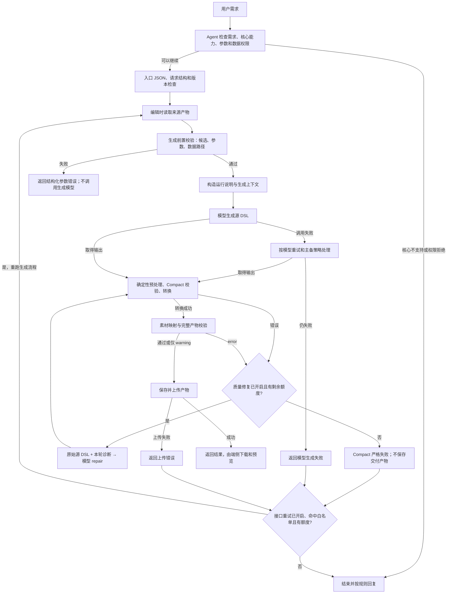

# 校验、重试与兜底机制入门指南

> 面向第一次接触本项目的开发、测试和联调人员。核对日期：2026-10-08；代码基线：`c3fa7eda`。
> 本文描述包含 [Compact 校验器重构 PR #423](https://github.com/InnovationTea/CreateMyCard/pull/423) 的代码；
> 重构合并前，分类目录与专项文档的相对链接需在该重构分支中查看。本文档 PR 应在 #423 合并并复核后合入。
>
> 本文是现状导读和排障索引，不新增协议或业务规则。[云侧方案设计](云侧方案设计.md)仍是唯一方案依据。
> 下文分别标注方案约定、当前实现和仓库默认配置；发现差异时只登记，不替代负责人裁决。
> 配置数字不代表线上实际配置；本次没有访问线上服务，也没有执行真实模型、设备或 OBS 联调。

## 阅读导航

- 想先理解整体：阅读第 1～3 节。
- 想知道具体检查什么：阅读第 4～6 节。
- 想知道失败后重试多少次：阅读第 7 节。
- 想了解降级、替代路线和编辑保护：阅读第 8～9 节。
- 正在排查问题：阅读第 10 节，并核对第 11 节的已知差异。
- 想复现本文核对过程：阅读第 12 节。

## 1. 先记住这几个结论

1. **校验贯穿整个链路。** 生成前检查需求、能力、权限和参数；生成后检查源 DSL、转换结果和完整产物；端侧还有运行时数据检查。
2. **报错不等于统一重试。** 参数错误通常需要修正请求；模型调用失败可以重发；DSL 错误可以带诊断让模型修复；接口级重试则重新执行一轮生成流程。
3. **仓库默认开启完整产物校验，关闭模型失败重试、质量修复和接口级重试。** 默认上限为 1 并不表示重试已经启用。
4. **标准 A2UI 入口与 Compact 入口处理不同。** 当前代码中，标准入口的完整产物校验错误可以记录后保存；Compact 普通生成路线在转换失败或仍有校验错误时返回失败，不保存交付产物。
5. **警告通常只记录，不触发质量修复。** 但“语义”“质量”是检查类别或执行阶段，不能据此推断一定只是警告。
6. **兜底不是保证生成成功。** 核心需求无法满足、权限明确拒绝、编辑来源损坏、严格校验持续失败，都有终止路径。
7. **线上主 Agent 不自行补造卡片。** 在线 Skill 明确要求工具失败后停止，不在本地生成替代 DSL、上传替代文件或无限重试。

特别注意：仓库默认还开启模型 mock、IDS mock 和编辑来源下载 mock。默认配置下的普通生成可读取本地模型样例，不能把一次成功解释为真实模型和设备链路已经联通。

## 2. 基本概念和职责

| 名称 | 可以怎样理解 | 主要负责方 |
|---|---|---|
| 主 Agent / 在线 Skill | 与用户对话，判断需求能否做成卡片，挑选能力并检查权限 | Agent 编排 |
| 能力注册表 | 当前版本允许使用哪些数据、点击动作和素材，以及输入输出约束 | 微服务 |
| DSL / genui | 描述卡片组件、布局、绑定和事件的内容 | 模型生成，微服务校验和转换 |
| Compact DSL | 模型使用的紧凑源格式；不能直接当作标准三行 A2UI 消息 | Compact 生成路线 |
| CardSpec | 卡片名称、尺寸、数据能力调用及数据写入位置等运行约定 | 微服务构造 |
| TaskSpec | 给生成过程使用的需求、数据结构和候选上下文 | 微服务构造 |
| artifact（产物文件） | 包含 genui、CardSpec、版本信息等的交付文件 | 微服务保存，端侧下载 |
| repair（定向修复） | 把上一轮源 DSL 和错误说明发给模型，请它输出修正后的完整内容 | 微服务 |
| fallback（兜底） | 切备用模型、切生成路线、使用默认版本等不同机制的统称 | 必须按具体机制判断 |

“生成成功”表示云侧得到了可以交付的结果，不表示已添加到桌面。预览、用户确认添加、运行时刷新属于端侧职责。

本文是开发排障文档，因此保留接口和代码名；实际面向卡片用户的回复不应暴露这些内部字段、产物 URL 或原始错误。

## 3. 一次请求经过哪些检查

下图描述普通 Compact 生成主线；模板和 JSX 分支见第 8 节。



三条边界很重要：

- 入口参数恢复发生在请求归一化之前，不属于图中生成后的 repair。
- 标准 A2UI 入口没有 Compact 源格式校验，完整产物校验仍有错误时的保存策略也不同。
- 端侧安装后刷新数据不重新调用云侧生成模型。

主要编排位置：[routes.py](../widget_service/cloud/api/routes.py)、[widget_generation_service.py](../widget_service/cloud/services/widget_generation_service.py)、[generation_pipeline.py](../widget_service/cloud/services/generation_pipeline.py)。

## 4. 生成前校验：尽量在调用模型之前发现问题

### 4.1 需求与能力门禁

这是主 Agent 按总方案执行的业务判断，不是 Python DSL 校验器。

| 检查 | 失败或缺失时如何处理 |
|---|---|
| 是否属于桌面卡片任务，内容是否适合卡片承载 | 明确不适合时结束；有歧义只追问一个必要问题 |
| 当前版本和设备有哪些可用数据、动作、素材 | 先获取能力概述；必要时加载数据 schema，两个阶段都要检查核心需求满足度 |
| 核心需求、用户声明“必须包含”的内容是否可实现 | 无法保留原意则结束；改变主要用途的替代方案需要用户确认 |
| 仅次要内容不可用 | 先说明缺失，再按剩余核心内容生成；不能只因还剩一个能力就认定可以降级 |
| 参数是否完整，是否来自可靠来源 | 用户偏好或歧义目标需要追问；客观事实可按方案查询补齐，不得猜测或填占位符 |
| 外部事实是否可靠、相关、可采用 | 核心来源失败则结束；次要来源失败后，只有核心仍成立且参数完整才能继续 |

能力概述阶段由 [device_capability_resolver.py](../widget_service/cloud/services/device_capability_resolver.py)结合注册表和 IDS 安装包结果过滤。
当前检查受配置的包名范围限制，不代表枚举验证设备所有应用、权限、应用版本或每个实际调用结果。
生成阶段不重新查询 IDS，继续检查的是注册状态、参数和结构。

### 4.2 数据权限门禁

| 端工具结果 | 处理 | 本轮自动重试权限工具 |
|---|---|---|
| 总权限明确为真、未授权清单缺失或为空，权限项没有明确拒绝 | 继续后续来源处理与生成 | 不需要 |
| 总权限为假，或任何权限项明确为假 | 立即停止；有有效授权明细时引导设置 | 不重试 |
| 未授权清单非空 | 停止，按名称和设置路径引导用户授权 | 不重试 |
| 工具正常返回，但结果缺失、非法或无法确认授权 | 停止，不能按异常默认放行 | 不重试 |
| 工具不可用、调用抛错、超时、传输失败，或工具层失败且没有正常权限结果 | 按方案例外静默默认放行；不伪造成功结果，不宣称权限已开启 | 不重试 |
| 纯静态或仅入口卡，无数据能力 | 跳过该工具 | 不适用 |

依据：[总方案权限接口](云侧方案设计.md#requestdatapermission)、[在线运行指南](../skills/harmony-card-generation-online/references/runtime-guide.md)。

### 4.3 请求结构与编辑来源

入口先处理 JSON 和工具请求封装，再通过 Pydantic 请求模型检查类型、必填字段及 create/edit 语义。
例如新建缺少标题或说明、编辑来源为空、编辑候选数组显式传 `null`，会在模型生成前拒绝。
编辑数组“省略”“空数组”“完整数组”分别表示继承、清空、替换，不能互换。

编辑还要检查来源文件能否读取、编码和命名代码块能否解析、schema 是否支持、产物结构是否完整。
Compact 编辑必须取得非空源设计文本，并通过目标处理器验证；不能用标准 genui 冒充原始设计文本。
来源读取边界见第 9 节。

### 4.4 生成前置校验（GenerationPreflight）

当前主生成流程实际调用 [generation_preflight.py](../widget_service/cloud/services/generation_preflight.py)。
不要仅根据旧的 `resolve_generation_*` 辅助函数推断所有非法候选都会被静默删除。

| 检查对象 | 当前检查内容 | 典型结果 |
|---|---|---|
| 数据候选 | 能力存在且未停用；入参符合 inputSchema；入参必须是静态 JSON，不能夹带 DSL 绑定或表达式 | 未知能力、参数错误，阻断 |
| 数据写入位置 | 严格 JSON Pointer，位于 `/data` 下；不同候选不能同路径、互为父子或相互覆盖 | 路径错误或写入冲突，阻断 |
| 展示字段投影 | 每个候选字段能解析到对应 outputSchema 的规范叶子路径，数组使用数字下标 | 任一非法字段产生前置错误，见第 11 节差异 |
| 事件候选 | 能力已注册、call 匹配、固定参数及参数 schema 正确；动态引用合法且符合注册模板 | 事件调用、参数或路径错误，阻断 |
| 事件依赖 | 事件所依赖的数据是否存在 | 特定“依赖数据缺失”分支记录警告并移除事件；不是所有事件错误都允许移除 |
| 素材候选 | 素材 ID 在当前注册表中 | 未知素材，阻断 |

只要存在阻断项，本轮不构造可用于生成的完整计划、不调用生成模型，抛出 `GenerationPreflightError`。
错误详情包含阶段、问题路径、期望约束、参考信息，以及 `modelCalled: false`。
外层错误码按问题集合选择：优先 `UNKNOWN_CAPABILITY`，其次 `WRITE_RESULT_CONFLICT`，其它归 `INVALID_ARGUMENTS`。

服务端给出的处理建议包括：

- `REFRESH_CAPABILITIES`：刷新能力信息并重新选择。
- `FIX_AND_RETRY`：修正全部参数问题后重新提交，不能原样重发。
- `REMOVE_OPTIONAL_CANDIDATE`：在允许的分支移除次要候选。
- `STOP`：停止。

这些是错误详情中的建议，不是自动循环执行器，也没有在这里定义主 Agent 的统一重试次数。
当前在线 Skill 对工具调用失败要求停止，与上述“修正后重提”建议的衔接仍需澄清，见第 11 节。
数据候选集合改变时，按方案必须重新检查对应权限。

## 5. 模型输出后的校验：源格式与完整产物是两层

### 5.1 普通 Compact 源格式校验

顺序为：确定性绑定路径预处理 → Compact 校验 → 转换为标准 A2UI → 重复单位后处理 → 素材映射 → 完整产物校验。
确定性处理不会调用模型，不消耗 repair 次数，也不能替代后续检查。

Compact 公开兼容入口为 [compact_dsl_validator.py](../widget_service/cloud/services/card_validation/compact_dsl_validator.py)，实际实现在
[compact_validation/](../widget_service/cloud/services/card_validation/compact_validation/)。
一级分类为“语法”和“语义”；具体检查主要归属如下。

| 分类 | 检查什么、为什么归这里 | 当前实现位置 |
|---|---|---|
| 语法／协议 | 输入行、记录与解析是否符合源格式 | 既有 [compact_dsl_a2ui_converter.py](../widget_service/cloud/services/compact_dsl_a2ui_converter.py) 解析器，校验入口包装异常 |
| 语法／组件 | 属性类型、必填项、父子关系、事件对象结构；素材字段类型也属于组件契约 | `compact_validation/syntax/components.py`；组合组件部分委托转换器 |
| 语法／表达式 | 引用和表达式包装是否符合语法 | `compact_validation/syntax/expressions.py` |
| 语法／CardSpec | CardSpec 自身字段是否合法 | Compact 不重复实现完整检查，由完整产物层负责 |
| 语义／数据绑定 | 引用能否取到首帧数据；数据类型是否适合组件，例如 Progress 需要数值 | `compact_validation/semantic/bindings.py` |
| 语义／跨文件一致性 | 首帧值、数据根和外部 schema 声明是否一致，是否新增未声明字段 | `compact_validation/semantic/cross_file.py` |
| 语义／有效能力 | 具体素材、事件调用及参数是否在本轮允许范围内 | `compact_validation/semantic/effective.py` |
| 语义／展示语义 | 布尔值表达、单位、字段标签、重复内容、必要信息和动作是否准确完整 | `compact_validation/semantic/display.py` |
| 语义／布局与视觉约束 | 高度预算、字号、间距、骨架、密度、融球和 SVG 染色 | `compact_validation/semantic/layout/`；复合调用由 `flows/` 编排 |

例子：

- `ActionUnit.icon` 是数字：组件语法错误，`COMPACT_ACTION_ICON_INVALID`。
- 图标路径是字符串，但不在候选集合中：有效能力错误，`COMPACT_ASSET_NOT_ALLOWED`。
- 可染色 SVG 没有显式颜色：布局与视觉约束错误，`COMPACT_SVG_FILL_COLOR_MISSING`。
- 布局已声明的最小高度超过参考画布扣除 padding 后的可用高度：进入严格错误和 repair 链路。分布式对齐不能抵消负剩余空间。
- 有数据声明但未实际展示：现有部分分支输出 warning；不能把“未使用声明”都算成硬错误。

上述表是新人理解用的分类索引，不是逐条规则副本。
完整检查位置、例外和归属见[规则分类清单](compact-dsl-validator-refactor/Compact_DSL现有校验规则分类清单_v1.md)。
清单中的 153 个静态输出位置不等于 153 个独立业务规则，也不等于一次调用会报 153 个错误。
专项待决项见第 11 节。

### 5.2 标准 A2UI 与完整产物校验

[ArtifactValidator](../widget_service/cloud/services/validator.py)调用服务内 Python API，传入完整产物；不启动 Skill 脚本或子进程。
规则配置来自 [validator_rules/](../widget_service/cloud/data/validator_rules/)，动态白名单由本次有效能力和产物记录的能力版本构造。

执行流水线分为 `hard → semantic → quality`。
这个阶段命名与上一节“语法／语义”的规则归属是不同维度，`hard` 也不直接决定服务最终是否保存。

| 阶段 | 校验器文件（位于 `cloud/services/card_validation/`） | 主要检查 |
|---|---|---|
| 解析 | `source_parser.py` | JSON、输入代码块和源位置；`DSL_JSON_PARSE_FAILED` 会阻止后续流水线 |
| hard | `protocol_validator.py` | 标准 genui 恰好三行，消息顺序、surfaceId 一致性、catalog 和表面结构 |
| hard | `component_validator.py` | 组件及属性白名单、children 引用和事件对象结构，动态值所在位置是否合法 |
| hard | `aesthetic_baseline_validator.py` | 基础可读性与素材基线，例如禁止 emoji 图标、字号不得低于其最低阈值 |
| hard | `cardspec_validator.py` | 尺寸、必填静态字段、数据绑定声明等 CardSpec 结构 |
| hard | `expression_validator.py` | 表达式语法、长度、深度、函数和允许使用位置 |
| hard | `asset_validator.py` | 素材路径及来源约束；禁止任意网络图、内联或 base64 SVG 等 |
| semantic | `binding_validator.py` | 引用路径能否从首帧数据、schema 和有效写入根推导；动态输出下不得添加未授权字段 |
| semantic | `display_unit_validator.py` | 需要单位的值是否漏单位，已有单位的值是否重复附加单位 |
| semantic | `cross_validator.py` | DSL 和运行声明一致，包含日程展示下标与点击下标一致等跨对象约束 |
| semantic | `effective_capability_validator.py` | 实际数据、事件及素材使用是否符合本轮有效范围，事件参数是否匹配允许目标 |
| quality | `contrast_validator.py` | 文本与背景对比度，含绑定文本、表达式文本和渐变背景采样 |

素材映射是受控例外：模型使用注册素材原始路径，微服务可把已批准的路径映射为交付 URL；校验器会接收对应映射。
这不代表模型可以任意生成网络图片地址。

标准协议中的事件限制包括：只使用允许的 `onClick`，每个事件一个 handler，不带 `condition`、`as` 或 `$context`，call/args 必须匹配有效候选。
标准三行约束针对转换后的 genui，不能直接拿来要求 Compact 源文本或 JSX 也只有三行。

### 5.3 单位、对比度和模板例外

- **重复单位先做确定性清理。** 普通标准或 Compact 处理器会根据最终数据声明删除已知重复单位；不会猜测缺失单位。缺失由后续校验报告。
- **相邻单位不是任意文本搜索。** 只扫描连续相邻静态 Text，遇到动态字段、非 Text 或独立说明就停止；“40 分”后的“平均 135 次/分钟”不能因为也含“分”就被删。
- **渐变对比度采用采样。** 不透明渐变覆盖父背景；至少三个样本时可忽略一个最差样本，其余仍差会报错或告警。纯色没有这个容忍规则。
- **有效模板根有局部豁免。** `root` 直接引用真实 `template_root` 且没有重复 ID 时，跳过完整产物 `quality` 阶段和 `DISPLAY_UNIT_MISSING`；仍检查重复单位及其它 hard/semantic 规则。普通 Compact 主文字检查也识别该标记。
- **豁免不等于模板不校验。** 服务中“已由模板生成的源文本”还会跳过通用 Compact 校验调用，这是另一个更上层的分支；转换结构检查和启用后的完整产物校验仍执行。模板路线有自身检查，见第 8.4 节。

### 5.4 校验结果如何记录

完整产物 API 返回 `Reporter`，包括级别、规则码、阶段、文件种类、行号、JSON Pointer、实际值、期望和修复提示等。
默认 `max_errors=50`，默认不因某阶段首个普通错误就停止下一阶段；解析失败等仍有专门短路。
因此一次报告可能包含多条有关联的错误，也不保证列出产物中的所有问题。

`ArtifactValidator` 只把 error 送入质量修复判断；warning 进入日志。
校验器自身抛异常时会被转换为 `validator execution failed: ...` 错误并记录堆栈。
这可能进入同一修复判断，但修复模型未必能解决规则文件缺失或校验器程序错误，应首先检查服务端。

Compact 规则保留原异常、错误顺序和按旧文案去重的兼容行为。
结构化诊断区分事实、约束、建议和源位置；无法可靠映射到原始 DSL 时不编造行号。
建议格式化失败时沿用旧说明，不能吞掉原错误或放宽规则。warning 不会混入 repair 错误列表。

## 6. 报错后究竟会怎样

| 报错阶段 | 当前主要处理 | 本轮是否保存交付产物 |
|---|---|---|
| 需求、核心能力或权限门禁 | Agent 提前结束或必要追问 | 否，尚未生成 |
| 请求 JSON、请求模型或生成前置参数 | 返回入口错误／结构化前置错误，不进入生成模型 repair | 否 |
| 来源产物不可读、损坏或版本不支持 | 编辑失败，保留原卡片，不自动改成新建 | 否 |
| 模型调用失败、空输出、错误标记输出 | 根据模型重试／主备开关尝试；耗尽后 `A2UI_GENERATION_FAILED` | 否 |
| Compact 校验或转换失败 | 有质量额度则 repair；否则 `VALIDATION_FAILED` | 否 |
| Compact 路线转换成功，但完整产物仍有 error | 有质量额度则 repair；耗尽或未开启则 `VALIDATION_FAILED` | 否 |
| 标准 A2UI 路线完整产物有 error | 有质量额度则 repair；仍有错误时记录非阻断日志，继续保存最后输出 | 可以保存，不代表通过校验 |
| 只有 warning | 记录警告，继续流程 | 后续保存成功即可 |
| 上传失败 | 上传边界抛出异常；Compact 接口级重试可重跑整轮 | 可能已有本地排障文件，但没有成功交付结果 |
| 未识别的服务异常 | 交给路由错误处理；不能默认全部自动重试 | 取决于异常时点，不能假定已交付 |

**关闭完整产物校验不会关闭普通 Compact 校验和转换。** `enable_artifact_validation=false` 仅跳过后面的 ArtifactValidator。
源格式非法、转换不出标准 genui，仍可能失败。

错误也有三层，不应混为一谈：

1. 对外业务状态：`success / degraded / unsupported / failed`。
2. 对外业务错误码：如 `INVALID_ARGUMENTS`、`VALIDATION_FAILED`。
3. 具体规则或内部质量码：如 `COMPACT_SVG_FILL_COLOR_MISSING`，或外层包装 `COMPACT_DSL_VALIDATION_FAILED`、`DESIGN_CONVERSION_FAILED`、`ARTIFACT_VALIDATION_FAILED`。

参数异常和通用异常还可能走 WebSocket 错误帧；通用异常的外层错误码可能为 `FAILED`，并不保证每种异常都包装成业务响应中的同名枚举。

## 7. 如何重试、重试几次

### 7.1 先确认实际配置从哪里来

读取逻辑见 [config_helper.py](../widget_service/cloud/config/config_helper.py)和 [config.py](../widget_service/cloud/config/config.py)。
本地优先读取绿区 `spec_records.yaml`，云端优先读取部署的 properties；对应文件不存在才使用
[default_config.yaml](../widget_service/cloud/config/default_config.yaml)。**绿区配置存在时不与默认文件合并。**
还要检查 Settings 的实际实例值及测试覆盖，不能只看一个 YAML 推断所有环境。

本次工作区未发现该绿区目录，以下仅列仓库默认值。

| 机制 | 开关默认值 | 次数配置默认值 | 开启后意味着什么 |
|---|---|---|---|
| 完整产物校验 | `enable_artifact_validation=true` | 无 | 执行标准产物校验，不是重试开关 |
| DSL 质量修复 | `enable_validation_failure_retry=false` | `validation_failure_max_repair_attempts=1` | 首次生成之外最多 1 次 repair；还要求当前路线准备了通用模型 prompt |
| 模型调用失败重试 | `enable_model_failure_retry=false` | `model_failure_max_retry_attempts=1` | 每次逻辑模型调用，主客户端首次之外最多再调用 1 次 |
| OpenAI 路由备用客户端 | `enable_openai_fallback=true` | `fallback_model_failure_max_retry_attempts=1` | 还必须开启模型失败重试；主客户端耗尽后，备用首次之外最多再调用 1 次 |
| Compact 接口级重试 | `enable_compact_dsl_interface_retry=false` | `compact_dsl_interface_retry_count=1` | 首次流程之外最多重跑 1 次，合计最多 2 轮 |
| Compact 字符串参数恢复 | `enable_compact_dsl_argument_repair_fallback=false` | 提醒次数 1；`compact_dsl_argument_repair_max_attempts=2` | 满足连续异常门槛后，最多 2 次逻辑模型参数恢复尝试；不是 2 次额外尝试 |

当前代码的质量次数可配置为大于 1，默认值仍为 1；总方案写“最多 1 次”，此差异见第 11 节。

### 7.2 模型调用失败重试：重新请求同一份任务

执行者：[UnifiedModelClient](../widget_service/cloud/custom/unified_model_client.py)。
触发包括客户端调用抛异常、空文本、以约定模型错误标记开头的输出。
只要返回非空候选 DSL，语法或质量是否正确要交给后续校验；**DSL 不合格本身不会在此层切备用模型。**

- `mep` 路由：只有主客户端计划，最多 `1 + 主客户端额外重试数` 次。
- `openai` 路由：先主客户端；只有模型失败重试与备用开关均开启才加入备用计划。
- 默认主、备各额外 1 次，全部开启且每一步都需要时：`主 2 次 + 备 2 次 = 最多 4 次物理调用`。
- 质量 repair 是新的逻辑调用，重新从主客户端开始，也可能经历上述调用失败重试。
- MEP 特定中止码 `6241` 在允许回收部分输出且有非空内容时可恢复文本，随后仍进入相应处理链，不表示直接判为合格。

同一客户端内的重试有退避：初始 1 秒、倍数 2、上限 30 秒、抖动比例 0.2，首次通常在 0.8～1.2 秒之间。
主备切换本身没有额外退避循环。具体值均可配置。

默认排队超时和单次模型请求超时各为 120 秒；它们不是整次卡片任务的统一总超时。
同步模型客户端超时后仍可能等待物理调用退出，不能把 120 秒解释成任务必定结束的承诺。

### 7.3 质量修复：把错误反馈给模型

执行者：[RetryController](../widget_service/cloud/services/retry_controller.py)和生成服务中的 `repair_source_dsl`。

1. 首次生成源 DSL。
2. 运行当前路线的处理和校验，收集 error。
3. 没有 error 则结束；只有 warning 也结束。
4. 未开启质量修复则不调用模型 repair。
5. 开启后，携带原始源文本、本轮错误和约束构造 repair prompt。
6. 取得修复文本后重新执行该路线完整处理链；还有错误且有额度则继续。
7. 次数耗尽后按第 6 节的路由策略失败或保存；不是所有路线都保存失败输出。

默认开启质量修复后，一轮普通生成最多是 `首次 1 次 + repair 1 次 = 2 次逻辑调用`。
该控制器没有睡眠退避；底层模型调用失败时才可能执行第 7.2 节的退避。
repair 调用本身最终失败时，服务返回模型生成失败，不回捡上一份错误 DSL 当作成功产物。

### 7.4 接口级重试：重新执行生成业务流程

执行者：[compact_dsl_interface_retry.py](../widget_service/cloud/services/compact_dsl_interface_retry.py)。
当前接在 Compact 的 WebSocket 路由，位于参数恢复、请求归一化和请求模型检查之后。
直接调用 `WidgetGenerationService` 不会自动获得这层重试；其它生成入口也不自动套用。

白名单为：

- 返回 `failed`，且错误码为 `A2UI_GENERATION_FAILED`、`VALIDATION_FAILED`、`ARTIFACT_UPLOAD_FAILED` 或 `TIMEOUT`。
- 抛出 `A2UIModelGenerationError`、`ArtifactUploadError`、`TimeoutError` 或 `ConnectionError`。

成功、降级、不支持、非白名单失败、参数异常、程序异常以及取消不会在这里原样重试。
每轮使用原始请求的深拷贝，避免上一轮归一化污染下一轮；编辑来源不替换成中间失败轮次的产物。

它重跑的是生成业务流程，包括必要的来源读取、前置校验、生成和保存，**不是只重新上传同一文件**。
没有内置等待或指数退避；开始指令最多尝试发送一次，最终只对外发送最终结果。

### 7.5 参数恢复：独立、默认关闭的入口兜底

执行者：[compact_dsl_argument_repair.py](../widget_service/cloud/services/compact_dsl_argument_repair.py)。
只针对 Compact 请求显式出现字符串化 `content.arguments` 的场景，不是通用业务参数自动修复。

- 必须打开开关且存在 requestId。
- 按同一 requestId 的连续异常次数累计；默认提醒阈值 1，即首次走正常参数错误路径，后续再次命中才开始恢复。
- 这不表示首次错误返回后服务会自行再次调用接口，必须实际收到后续请求。
- 模型恢复默认最多尝试 2 次，代码把配置约束到 1～3 次；每次逻辑调用内部仍可能叠加模型失败重试。
- 恢复出的候选会按注册表重建、规范化并进行请求和前置检查。
- 都失败后会构造最小请求：新建清空动态候选并尝试静态生成；可提取有效编辑来源时保留编辑来源，省略候选以走继承。

此最小请求兜底不能被当成“核心实时需求可以无条件改成静态卡”的业务许可。它与总方案的核心需求保护需要专门确认，见第 11 节。

### 7.6 多层次数怎样叠加

对**普通 Compact 模型路线**，先排除参数恢复、模板和 JSX 内部流程，定义：

- `I`：接口执行总轮数；关闭接口重试时是 1，开启时是 `1 + interface retry count`。
- `R`：每轮允许的额外质量 repair 数；关闭质量修复时是 0。
- `M`：主客户端额外失败重试数；关闭模型失败重试时是 0。
- `F`：备用客户端额外失败重试数。

条件性上界：

```text
没有备用计划：物理模型调用数 ≤ I × (1 + R) × (1 + M)
启用备用计划：物理模型调用数 ≤ I × (1 + R) × [(1 + M) + (1 + F)]
```

例如关闭 mock 后，三个重试开关全开，次数保持默认，并启用主备：上界为 `2 × 2 × (2 + 2) = 16`。
这是所有层都走到相应额度时的预算上界，不是每个请求一定调用 16 次；前置拒绝、成功提前退出或某次模型彻底失败都会减少调用。
默认三个重试开关均关闭时没有这些额外调用；默认 mock 开启时，普通模型生成通常没有远程模型调用。

服务汇总中的 `retryCount` 是当前生成轮的模型重试计数加质量 repair 计数。
模型计数包含备用切换，不是只有“同模型再次请求”。接口轮数看 `interface_attempt_*` 日志；参数恢复、模板和 JSX 还应查看各自记录。
不能把一个 `retryCount` 当作整个用户请求的所有物理调用次数。

仓库另有 `cloud/errors/retry.py` 通用执行器，其 `max_attempts` 表示总次数并有自身预设。
它不替代以上已核对的卡片主调用链，不能见到其默认 3 就得出“卡片统一重试 3 次”。

## 8. 兜底策略分别是什么

### 8.1 业务降级

保留核心需求，删除不可用的次要内容，向用户说明本次缺失。
`degraded` 由最终生成结果中的移除记录等确定，不等于“曾经重试过”。
如果 Agent 在调用前已经收敛候选，服务可能返回 `success`，Agent 仍需按原需求说明确定的缺失。
不能仅凭服务返回 `success` 推断用户原始需求全部满足。

用户要求“必须有实时日程，否则不要生成”，日程不可用时必须停止；静态装饰卡不是合法替代。
静态卡或入口卡只有本来就满足原核心目标时才可以作为结果。

### 8.2 版本和设备信息兜底

| 机制 | 当前实现 | 不代表什么 |
|---|---|---|
| 默认能力版本 | 查不到版本区间且开关开启时尝试默认注册表，默认开关为真 | 不能证明真实设备支持所有能力 |
| 默认协议版本 | Compact 协议区间选择失败且开关开启时加载默认协议和设计 prompt，默认开关为真 | 不等于端侧兼容已经验证 |
| IDS 请求失败或 mock 无法加载 | 记录异常，返回空安装状态／空命名空间；当前客户端未见额外重试循环 | 不是伪造应用已安装；受安装过滤的依赖可能变不可用 |
| 数据权限 invoke 异常 | 按方案特殊规则静默放行 | 不能套用于明确拒绝或正常返回的非法权限结果 |

默认版本仍不可用时，根据所在入口返回空能力信息、缺失能力清单或不支持／异常，不保证继续成功。

### 8.3 模型主备兜底

见第 7.2 节。主备解决调用层失败，不直接解决业务能力不足、错误参数或 DSL 布局不合格。
备用开关为真但模型重试开关为假时，当前代码不会调用备用客户端。

### 8.4 模板和 JSX 生成路线

这些是服务端路线，不是主 Agent 失败后调用离线 Skill。仓库默认 `enable_card_template=false`、`enable_jsx_generation=false`。

普通 Compact 新建的选择顺序如下：

| 开启情况 | 源生成失败后的路线 |
|---|---|
| 两者都关闭 | 直接走普通 Compact 模型生成 |
| 仅模板开启 | 先模板；模板源生成抛异常后回到普通 Compact 模型路线 |
| 仅 JSX 开启 | 走 JSX；当前 Compact 包装配置不再回退普通模型路线 |
| 模板与 JSX 都开启 | 模板失败后尝试 JSX；JSX 再失败则结束该轮 |
| 独立 Terse 模板入口 | 使用模板路线，不设置普通模型兜底；当前不支持二次编辑 |

上述切换发生在**源生成函数抛异常**时。模板已经返回文本，随后公共转换或产物校验失败，不会自动重新进入这个选择流程。
是否再进行通用质量 repair 取决于 `enable_validation_failure_retry` 和是否准备通用 prompt；模板专用或无通用兜底的路线不能直接套用“额外 repair 1 次”。

模板路线有自身的覆盖、模板选择、布局和编译检查，不能静默删掉必须保留的业务来通过。
模板正文生成当前 `_MAX_BODY_REPAIRS=2`：在该内部校验修复分支，首次之外最多修复两次。
这与公共质量开关独立，次数只描述正文阶段，不代表整个模板流程仅调用三次模型。
模型客户端仍复用统一调用层，因此还可能叠加物理调用重试。
参见 [template_generation/engine/pipeline.py](../widget_service/cloud/services/template_generation/engine/pipeline.py)和[模板专项方案](../widget_service/cloud/services/template_generation/docs/template-generation-design.md)。

JSX 路线包含内部生成、编译、动态值和浏览器布局检查。
桥接默认 `max_turns=20`，指内部交互总轮数，不是“失败后重试 20 次”；浏览器失败阈值默认 3，用于触发布局兜底，而非整条路线的统一次数。
内部有压缩组件阶段最多 2 次提交、删除可选组件阶段最多 3 次提交等预算；触发还可能受停滞、容量和其它计数影响，整体仍受总轮数限制。
不能删除必需事实或任意删除动作，预算耗尽或不可修复错误会退出。

当前生成服务对成功返回的 JSX 标准消息仅做交付素材映射，跳过公共 Compact/Artifact 质量处理和公共 repair，日志原因是 `jsx_internal_validation`。
因此不能把普通路线的重复单位后处理、模板根豁免或完整产物校验覆盖，未经核对就延伸到 JSX。
参见 [BridgeOptions](../widget_service/cloud/services/multi_step_generation/core/options.py)、[JSX agent](../widget_service/cloud/services/multi_step_generation/jsx_runner/agent.py)。

### 8.5 保存与上传

[artifact_store.py](../widget_service/cloud/services/artifact_store.py)先写本地文件，再调用上传适配器。
当前仓库的 [upload_file_obs.py](../widget_service/cloud/utils/upload_file_obs.py)实际复制到本地 `workspace/mock_obs` 并生成 mock 地址；不能把它当作真实 OBS 已接通的证据。

上传返回空地址、上传边界的连接错误或超时会转为 `ArtifactUploadError`。
本地写文件异常或任意其它异常不自动等同于可重试上传错误。
当前这两个模块没有“只上传重试 N 次”的独立循环；Compact 外层接口重试可重新生成并保存。
上传失败时本地文件可能已经存在，它只能作为排障材料，不能当作成功交付。

## 9. 编辑失败与端侧运行时失败

### 9.1 编辑来源保护

当前实现的重要边界：

- 编辑开关默认关闭，返回 `WIDGET_EDIT_DISABLED`，属于不支持，不在接口重试白名单。
- 来源 schema 当前要求 `widget-artifact-v2`；错误分为不存在、下载失败、schema 不支持、结构非法。
- 来源读取默认限制 20 MiB、35 秒，genui 和设计文本长度分别受 200,000 字符限制。
- mock 下载只按 URL 路径中的文件名读取本地 mock 目录，缺失不会再访问网络。
- remote 模式使用公共下载方法，不跟随重定向；repository 当前不做 URL 来源白名单校验，可信来源由调用方和部署网络保证。
- 源读取失败不会静默转为首次生成，也不覆盖来源产物。
- 新产物使用新的 UUID；后续编辑只有拿到合法新 URL 的 success/degraded 才更新内部来源。返回原 URL 不算新编辑节点。
- 公共产物校验开启时，还检查已删除数据写入根是否残留于编辑后的 DSL。

这些来源错误码不在 Compact 接口重试白名单中；读取不到原文件时，原样再生成不能解决来源问题。
实现位置：[source_artifact_repository.py](../widget_service/cloud/services/source_artifact_repository.py)、[edit_request_normalizer.py](../widget_service/cloud/services/edit_request_normalizer.py)。

### 9.2 卡片安装后的数据检查

按总方案，端侧根据运行声明调用数据能力，检查或归一化返回结果是否符合 outputSchema，再构造运行时 `updateDataModel`。
非法数据不能直接写入数据模型；数据更新后组件重渲染，无需重新向云侧生成卡片。

**本仓库云侧代码不能给出端侧刷新失败统一重试次数。** 端侧刷新调度、缓存、无权限提示和错误恢复需要查端侧实现及联调约定。
云侧重试 1 次、模型排队 120 秒等数字均不能套用到运行时刷新。

## 10. 常见问题与排查步骤

### 10.1 先按失败阶段分流

| 现象或错误 | 先查哪里 | 正确处理方向 |
|---|---|---|
| 生成工具根本没调用 | Agent 轨迹中的核心能力、参数、权限和来源门禁 | 先解决缺失条件，不排查 DSL |
| `INVALID_ARGUMENTS` / `UNKNOWN_CAPABILITY` | 前置详情中的 path、expected、referenceSource、modelCalled | 修正输入或刷新能力；不是提高模型修复次数 |
| `WRITE_RESULT_CONFLICT` | 多个数据写入路径是否相同或父子嵌套 | 选择不重叠路径并同步引用 |
| `COMPACT_SVG_FILL_COLOR_MISSING` | 实际源 DSL 中的 Image/CardHeader、素材描述和颜色属性 | 依注册素材染色规则修复，不换成未注册图片 |
| `VALIDATION_FAILED` | 源处理阶段、具体规则码、最终 errors 和 repair 记录 | 判断是解析、转换还是产物错误，再针对原文本修复 |
| 日志有校验 error，但返回成功 | 实际入口是否为标准 A2UI，是否走非阻断策略 | 成功不等于校验全部通过；核对策略而非删日志 |
| 想重试但没有发生 | 开关实际值、次数、路由接入位置、是否白名单、是否只有 warning | 上限非零不代表开关开启 |
| 备用开关已开却没有备用调用 | 模型重试是否也开、是否 openai 路由、是否为调用错误 | 质量错误走 repair，不直接触发备用 |
| `A2UI_GENERATION_FAILED` | `phase` 是 initial 还是 repair；客户端异常、空输出、排队及请求超时 | 排查调用配置和客户端，不先修改布局 |
| `SOURCE_ARTIFACT_*` | 编辑开关、来源文件、schema、源设计文本和下载模式 | 保留原卡，修复来源问题 |
| 最终没有可下载地址 | 本地文件保存与上传边界、mock 模式、路由错误帧 | 区分本地存在与实际交付成功 |
| 安装后数据不刷新 | 端侧能力调用、权限、返回 schema、写入路径和 surface | 走端侧刷新排查，不盲目重新生成 DSL |

### 10.2 三个典型过程

**例一：数据写入路径冲突。** 两个候选分别写入 `/data/weather` 和 `/data/weather/current`。
前置校验报告冲突，本轮生成模型调用数为 0；接口级重试不处理参数异常。
应先改成互不覆盖的数据根，并同步相关引用；是否由 Agent 自动重新提交需按第 11 节的编排约定处理。

**例二：普通 Compact 卡高度已超预算。** 默认质量修复关闭时，直接严格失败；开启且上限 1 时，模型最多接收一次带高度错误的 repair。
仍超限则不保存。如果接口重跑也开启且额度 1，外层可以再跑一整轮；这属于额外生成轮，不是第二次同轮 repair。

**例三：标准入口对比度 error。** 默认完整产物校验开启、质量修复关闭，服务记录非阻断错误并可能继续保存。
相同完整产物 error 若发生在普通 Compact 严格路线，则会阻断保存。排障必须记录入口，不能只记录规则码。

### 10.3 推荐查看的日志顺序

1. 关联 requestId，确认生成入口、create/edit、版本选择和当前实际开关。
2. 查 `generation_preflight_rejected`，确定是否尚未调用生成模型。
3. 查 `model_call_failed`、`fallback_started`，区分主备、attempt、initial/repair。
4. 查 `dsl_conversion_failed`、`artifact_validation_failed` 和具体规则码。
5. 查 `a2ui_repair_started` 与 `a2ui_generation_completed`，核对 repair 次数和剩余错误。
6. 查 `strict_generation_validation_failed` 或 `a2ui_generation_validation_failed_non_blocking`，确认保存策略。
7. 查 `artifact_file_saved`、`artifact_uploaded`，确认本地文件和交付地址。
8. 有接口重试时，另查 `interface_attempt_started/finished/failed`、`interface_retry_scheduled`，不要只看最后一轮。

保存成功的产物可包含 `request`、源设计文本和 `repair-1` 等排障代码块。
严格失败提前退出时，不保证存在保存后的产物或 repair 文件，需依赖日志和测试回放。
单纯计算微服务 unsupported 比例不包含 Agent 在生成前就结束的请求。

## 11. 已发现的差异与待澄清范围

以下为当前核对结果，不在本文中擅自修改总方案、代码、Skill 或配置。

| 事项 | 总方案或上游约定 | 当前实现／现状 | 使用本文时的处理 |
|---|---|---|---|
| 完整产物错误是否阻断 | 总方案“校验与重试”概括为非阻断，另明确 Compact 高度错误严格阻断 | 标准入口非阻断；Compact/Terse 路由设置严格策略，完整产物 error 也阻断 | 按入口描述现状；方案应进一步明确不同入口的范围 |
| 质量修复次数 | 总方案写最多重新生成 1 次 | 默认 1，但控制器支持配置更大正整数，测试中也使用 2 | 不把可配置性当作业务已批准增加次数 |
| 展示字段投影错误 | 总方案写部分非法路径忽略、全部非法回退全部叶子字段 | 当前前置检查逐项报告 `OUTPUT_FIELD_PATH_INVALID`，阻止进入后续构造 | 不承诺非法投影可自动兜底；建议统一前置检查与方案 |
| 参数错误后谁负责重新提交 | 前置错误详情建议修正后重提、刷新能力 | 在线 Skill 对工具失败要求停止、不重试；未发现衔接这些建议的明确统一次数 | 错误建议不等于已落地 Agent 重试闭环 |
| 最小静态请求兜底 | 总方案要求保留核心用途；不能把核心动态需求任意改成静态 | 默认关闭的参数恢复耗尽后，可构造清空动态候选的新建请求 | 启用前需确认核心意图保护和用户说明，不能当通用降级许可 |
| 通用降级选项 | 请求模型存在 `allowDegradation` | 当前主流程未发现根据该字段统一控制降级的分支 | 不能只传 false 就假定禁止所有兜底 |
| 美观失败时简化卡片 | 总方案有简化布局、降低视觉复杂度的要求 | 普通 Compact 严格失败出口未见独立的“安全模板保证成功”分支；模板、JSX 各自另有路线 | 区分设计目标与实际自动兜底，不承诺必出卡 |
| 全量校验覆盖 | 总方案描述完整 artifact 校验 | JSX 成功返回后跳过公共产物校验，依赖内部流程；模板有不同层级的跳过 | 对应路线单独验证覆盖，不能用普通路线测试代替 |

Compact 专项已登记的 BASE-01～BASE-04 涉及高度基准、W9 倒计时结构、单位建议及日程计数边界，仍待独立裁决。
本次文档不改变现有判定，也不把等价重构完成解释为所有业务争议已解决。
参见[重构方案 v3](compact-dsl-validator-refactor/Compact_DSL校验器重构方案_v3.md)和[实施与验证记录](compact-dsl-validator-refactor/Compact_DSL重构实施与验证记录.md)。

## 12. 本次核对与验证记录

### 12.1 阅读和核对范围

核对了总方案、Compact 专项分类和实现、入口路由、请求模型、生成前置检查、生成处理器、完整产物校验、质量控制器、模型调用与主备、接口重试、参数恢复、来源读取、上传适配器、模板/JSX 分支，以及在线 Skill 的失败处理规定。
本次只新增说明文档和 README 导航，没有修改业务实现、规则、配置或协议。

### 12.2 已执行的行为验证

在 `widget_service` 目录使用现有虚拟环境执行：

```powershell
.venv/Scripts/python.exe -m pytest tests/test_service_units.py tests/test_generation_preflight.py tests/test_model_routing.py tests/test_compact_dsl_interface_retry.py tests/test_compact_dsl_interface_retry_routes.py tests/test_compact_validation_repair_integration.py -q --tb=short --show-capture=no -rs
```

结果：**361 项，356 通过、4 失败、1 跳过**，另有 1 条依赖弃用 warning。
这组测试在文档写入前执行，重复组合运行结果一致，因此不是本次 Markdown 修改引入的失败。

| 测试 | 实际失败／跳过原因 | 核对结论 |
|---|---|---|
| `test_service_units.py::test_phase_two_version_returns_phase_two_capability_overview` | 返回集合未包含测试期望的全部二期能力 | 既有能力清单与测试预期不一致 |
| `test_service_units.py::test_phase_two_version_returns_phase_two_capability_schemas` | 未返回预期中的 `GetMemoData`、`GetPhoneCallRecords` | 既有能力清单与测试预期不一致 |
| `test_generation_preflight.py::test_generation_tool_schema_matches_source_direct_result_contract` | 工具 schema 缺少测试期望的 `extrainfo`，抛 KeyError | 既有 schema 与测试契约不一致 |
| `test_compact_validation_repair_integration.py::test_online_restores_nested_facts_before_formatting_and_preserves_records` | 组合运行时修复消息是点击事件缺失诊断，未包含期望素材路径 | 单独复查该用例通过；疑似测试顺序或共享状态相关，根因未定位 |
| `test_service_units.py::test_cloud_asset_registry_matches_online_skill_allowlist` | 既有显式 skip 标记，说明“素材白名单快照同步已按本次要求忽略” | 未执行，不能算通过 |

对四个失败节点另作一次定点复查：**1 通过、3 失败**；这不覆盖或抵消组合运行的 4 项失败。
没有修改无关测试以使报告变绿。

本文不声称全量回归通过；未执行全部规则测试、真实模型请求、真实设备权限、浏览器视觉回归或真实 OBS 联调。
文档检查：2 个修改文件的 40 处本地链接全部可解析，3 个 Markdown 代码块均闭合；
未发现替换字符或行尾空白，`git diff --check` 通过。纯文档修改不涉及 Python Ruff。

### 12.3 继续阅读

- [云侧方案设计](云侧方案设计.md)：权威边界、接口、业务降级和端侧职责。
- [字段约束与演进记录](../widget_service/cloud/services/card_validation/字段约束与演进记录.md)：字段来源、约束和规则变化。
- [Compact 现有规则分类清单](compact-dsl-validator-refactor/Compact_DSL现有校验规则分类清单_v1.md)：逐项规则归属与位置。
- [多轮卡片编辑开发方案](多轮卡片编辑开发方案.md)：来源继承和编辑交付。
- [在线 Skill 主流程](../skills/harmony-card-generation-online/SKILL.md)：Agent 何时继续、停止和回复。
- [在线运行指南](../skills/harmony-card-generation-online/references/runtime-guide.md)：权限、参数与结果判定。
- [微服务 README](../widget_service/README.md)：运行和开发入口。
