# 第一、第二、第四接口内部流程

本文保留能力概述、能力 Schema 与 Compact 生成接口的系统级入口关系。接口契约仍以
[云侧方案设计](./云侧方案设计.md) 为准；Compact/Template 的实现细节已归档到
[`template_generation/docs`](../widget_service/cloud/services/template_generation/docs/README.md)。

## 共享 WebSocket 行为

三个接口都经过 `_serve_operation_websocket()`：

- 每个连接先 `accept`，更新 `active_connections` 和 `total_connections`。
- 每条消息更新 `running_tasks`，记录脱敏后的原始请求结构。
- 非法 JSON、非法包络和 Pydantic 参数错误在路由层终止。
- 业务内容位于 `reply.streamInfo.streamContent`，插件外层 `errorCode` 保持 `"0"`。
- 第一、第二接口在 AnyIO 线程池执行同步 Service，不发送周期心跳。
- 第四接口直接等待异步 Service，每 6 秒发送一次 `partial` 心跳。

并发资源分为 AnyIO 默认线程令牌、模型共享 Semaphore 和 llmclient 专用线程池。
等待模型令牌、执行、退避和 repair 的请求都计入 `running_tasks`。

## 第一接口：`getWidgetCapabilityOverview`



第一接口完成当前用户实际能力的前置裁决：

```text
请求包络
  -> App/ROM 能力注册表选择
  -> IDS mock 或远程安装快照
  -> 按受检依赖包名过滤 data/event
  -> dataCapabilities + unavailableCapabilities
  -> eventCapabilities + assetCandidates
```

| 关键条件 | 行为 |
| --- | --- |
| App/ROM 区间命中 | 加载对应能力注册表 |
| 未命中且默认回退开启 | 使用配置的默认注册表 |
| 无可用注册表 | 返回空能力结果，不查询 IDS |
| IDS mock 开启 | 只读本地 mock，不访问远程 |
| IDS 远程失败 | 按空安装快照处理 |
| 受检依赖包未安装 | 对应数据能力进入 `unavailableCapabilities` |
| 素材能力 | 不执行安装状态过滤 |

该接口只返回数据能力概述，完整输入/输出 Schema 由第二接口按需加载。

## 第二接口：`getDataCapabilitySchemas`



```text
dataCapabilityIds
  -> App/ROM 能力注册表选择
  -> 按输入顺序查找数据能力
  -> dataCapabilities + missingCapabilityIds
```

| 关键条件 | 行为 |
| --- | --- |
| `dataCapabilityIds=[]` | 正常返回两个空数组 |
| ID 已注册 | 返回完整 `DataCapability` |
| ID 未注册 | 只把当前 ID 放入 `missingCapabilityIds` |
| 输入包含重复 ID | 当前实现按输入顺序保留重复结果 |
| IDS 或安装状态 | 本接口不查询，只回答注册表是否存在定义 |

## 第四接口：`generateWidgetCardCompactDsl`

第四接口的 Template 路由、create/edit 分支、回退、Processor、repair 和 artifact 数据流已迁移到：

- [Compact Template 数据流](../widget_service/cloud/services/template_generation/docs/compact-dsl-data-flow.md)
- [Template Generation 共享架构](../widget_service/cloud/services/template_generation/docs/architecture.md)
- [Template Generation 模块与代码说明](../widget_service/cloud/services/template_generation/docs/modules.md)

系统级上，第四接口仍遵循：

```text
WebSocket
  -> App/ROM Profile 选择
  -> create/edit 归一化
  -> GenerationPreflight
  -> Template create 尝试（失败可回退原 Compact）
  -> DesignCompactProcessor
  -> ArtifactValidator / RetryController
  -> ArtifactStore / ResponsePlanner
  -> WebSocket final
```
