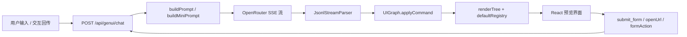

# Modesty UI / GenUI 软件实现设计文档

## 1. 项目概述

### 1.1 定位

Modesty UI（亦称 GenUI）是一个**生成式 UI（Generative UI）**实验项目：大语言模型（LLM）以流式方式输出 **JSONL 指令**，客户端逐行解析并增量构建 UI 图（`UIGraph`），再由 React（Web）或 HarmonyOS 宿主渲染为可交互界面。

核心目标：

- 将自然语言、Markdown、结构化 JSON 等输入，稳定收敛为**可解析、可流式、可交互、视觉一致**的 UI 协议流
- 在 Web 端提供完整的开发/演示/回归工具链
- 在 HarmonyOS 端提供与 Web 对齐的协议映射与样式预设（`.ets` 源码）

### 1.2 非目标

- 本仓库**不是**通用低代码平台；输出必须在宿主上可逐行解析与渲染
- `skills/` 目录定义 Agent 输出契约，**不实现**最终渲染器（渲染由 `genui-sdk` + `platform` 或 HarmonyOS 宿主完成）
- 不保证所有 LLM 输出 100% 合法；系统通过容错解析、自动续写、Gate Test 等手段提升可用性

### 1.3 双运行时架构

| 运行时 | 渲染层 | 协议映射 | 主要用途 |
|--------|--------|----------|----------|
| **Web** | React + Next.js | TypeScript（`platform/lib/`） | 开发演示、协议迭代、批量回归 |
| **HarmonyOS** | ArkUI 宿主 | ArkTS（`index.ets`、`design_handle.ets`） | 生产目标平台 |

两套运行时共享同一套协议语义（A2UI v0.9 / Compact mini），在**图模型层**统一，在**渲染层**各自实现。

---

## 2. 系统架构

### 2.1 分层架构

```
┌─────────────────────────────────────────────────────────────────┐
│  用户 / Agent 会话日志                                           │
└───────────────────────────┬─────────────────────────────────────┘
                            │
┌───────────────────────────▼─────────────────────────────────────┐
│  Platform 层（Next.js）                                        │
│  App.tsx · GateTestView · API Routes · DSL 转换工具              │
└───────────────────────────┬─────────────────────────────────────┘
                            │
┌───────────────────────────▼─────────────────────────────────────┐
│  GenUI SDK 层（npm workspaces）                                  │
│  prompt → llm-client → parser → graph → renderer + components  │
│                    interactions · mini-parser                      │
└───────────────────────────┬─────────────────────────────────────┘
                            │
┌───────────────────────────▼─────────────────────────────────────┐
│  协议 / 技能层（skills/）                                        │
│  a2ui（v0.9 NDJSON）· compact（极简元组 JSONL）                   │
└─────────────────────────────────────────────────────────────────┘
```

### 2.2 主数据流（LLM 生成路径）



**逐步说明：**

1. 用户在 `platform/src/App.tsx` 输入自然语言，或触发按钮/表单交互
2. 浏览器经 `platform/lib/genui-server-stream-client.ts` 调用 `POST /api/genui/chat`
3. 服务端组装 system prompt（来自 `@genui-sdk/prompt`），转发至 OpenRouter Chat Completions（SSE）
4. 客户端用 `JsonlStreamParser` 增量解析 token 流中的 JSONL 行
5. 每行解析结果调用 `UIGraph.applyCommand` 更新内存中的 UI 图
6. `renderTree` 将图节点映射为 React 组件树并渲染
7. 用户交互（`action.event` / `action.functionCall`）携带当前树 JSON 回传，进入下一轮 LLM 对话

### 2.3 协议双轨制

系统支持两种 LLM 输出协议，在图模型层汇合：

| 协议 | 标识 | 输出形态 | 适用场景 |
|------|------|----------|----------|
| **A2UI v0.9** | `protocol: "a2ui"` | 标准 NDJSON：`createSurface`、`updateComponents`、`updateDataModel`、`deleteSurface` | 完整 Extended 组件、复杂交互 |
| **Compact mini** | `protocol: "mini"` | 极简元组：`{"@surfaceId", ...}` / `{"surfaceId", "compId", "Type", {props}, [children]}` | Token 效率优先、HarmonyOS 对齐 |

Compact 协议可在客户端或平台层映射为 v0.9（`mini-parser`、`map-mini-to-a2ui-*`），再进入同一 `UIGraph`。

---

## 3. 仓库结构

```
modesty-ui/
├── README.md                 # 项目说明与快速开始
├── analyse.md                # 本文档
├── .env                      # API Key（gitignore）
│
├── platform/                 # Next.js 演示应用
│   ├── app/                  # App Router：页面 + API 路由
│   ├── src/                  # 客户端组件（App.tsx、GateTestView 等）
│   ├── lib/                  # 平台专属逻辑（DSL 映射、OpenClaw、Gate Test）
│   └── public/fonts/         # HarmonyOS Sans 字体
│
├── genui-sdk/                # npm workspaces 核心 SDK
│   ├── prompt/               # LLM 系统提示词组装
│   ├── llm-client/           # OpenRouter SSE 客户端
│   ├── parser/               # JSONL 流式解析 + 协议归一化
│   ├── graph/                # UIGraph 增量 UI 图
│   ├── components/           # React 组件（Extended.* + mini 别名）
│   ├── interactions/         # action 解析与 context 绑定
│   ├── renderer/             # renderTree + defaultRegistry
│   ├── mini-parser/          # Compact ↔ v0.9 双向映射
│   └── test-renderer/        # CLI：JSONL → 静态 HTML
│
├── skills/                   # Agent Skill 文档（嵌入 prompt）
│   ├── a2ui/                 # A2UI v0.9 协议 + Harmony 设计规范
│   └── compact/              # Compact mini 协议
│
├── index.ets                 # HarmonyOS：compact → A2UI v0.9 映射
├── design_handle.ets         # HarmonyOS：设计预设合并
├── fault_tolerance.ets       # HarmonyOS：compact 载荷容错
│
├── openclaw-analyzer-py/     # Python 版 OpenClaw 会话日志分析器
└── genui_protocol_evaluation_ba19f3b1.plan.md  # 协议演进评估笔记
```

---

## 4. 技术栈

| 类别 | 技术 |
|------|------|
| 语言 | TypeScript（主）、ArkTS/ETS（HarmonyOS）、Python（日志分析） |
| 前端框架 | React 18、Next.js 15（App Router） |
| 构建 | npm workspaces、`tsup`（SDK 打包）、Next.js webpack |
| LLM 接入 | OpenRouter Chat Completions（SSE 流式） |
| 工具库 | `html2canvas`（截图）、`react-markdown` + `remark-gfm`（混排 Markdown）、`dotenv` |
| 字体 | HarmonyOS Sans |
| 测试 | `tsx` 脚本式单元测试（无 Jest/Vitest） |

**开发时源码引用：** `platform/next.config.mjs` 通过 webpack alias 将 `@genui-sdk/*` 直接指向 SDK 源码，无需先 `npm run build`。

---

## 5. 协议设计

### 5.1 A2UI v0.9（默认协议）

**权威定义：** `skills/a2ui/SKILL.md` 及 `skills/a2ui/reference/protocol/`

**消息类型：**

| 消息 | 作用 |
|------|------|
| `createSurface` | 创建新 surface，重置该 surface 的组件树与数据模型 |
| `updateComponents` | 追加/更新单个组件（`components.length` 必须为 1） |
| `updateDataModel` | JSON Pointer 路径 → 值，供 `{"path":"..."}` 绑定解析 |
| `deleteSurface` | 销毁 surface |

**组件体系：** `Extended.*` 命名空间 + `styles` 信封（Common Styles），与 `skills/a2ui/reference/protocol/extended-ui-schema.md` 对齐。

**流式纪律（Progressive Visibility）：**

- 当 `updateComponents` 首次引入 `{"path":"..."}` 绑定时，必须**就近**发送 `updateDataModel` tail
- 避免「结构先到、数据流尾一次性灌入」导致首屏空渲染

**交互载荷：**

- `action.functionCall`：本地行为（如 `openUrl`）
- `action.event`：服务端事件（如 `submit_form`），`context` 仅允许 path 绑定与稳定字面量

**实现入口：** `genui-sdk/parser/src/protocol-v09.ts` 的 `tryNormalizeV09Protocol` 将 wire format 归一化为内部 graph 命令。

### 5.2 Compact mini 协议

**权威定义：** `skills/compact/SKILL.md`

**四种行形态（元组-in-braces，每行一条）：**

| 种类 | 首段规则 | 示例 |
|------|----------|------|
| createSurface | `"@"` + surfaceId | `{"@prefs", "https://.../catalog.json"}` |
| updateComponent | 普通 surfaceId，第二段非 `/` 路径 | `{"prefs", "btn", "Button", {"label":"保存"}}` |
| updateDataModel | 第二段以 `/` 开头 | `{"prefs", "/notice", "已保存"}` |
| deleteSurface | `"~"` + surfaceId | `{"~prefs"}` |

**组件类型：** `Card`、`Row`、`Column`、`Text`、`Button`、`Radio`、`Select`、`Checkbox`、`Input`、`Image` 等（见 schema）。

**实现入口：** `genui-sdk/parser/src/compact-parse.ts`

### 5.3 协议归一化 → UIGraph 命令

Parser 层将两种协议统一为 `UIGraph.applyCommand` 可消费的单键对象：

| 内部命令键 | 来源 |
|------------|------|
| `__createSurface` | v0.9 `createSurface` / compact `@surfaceId` |
| `__updateDataModel` | v0.9 `updateDataModel` / compact `/path` 行 |
| `__deleteSurface` | v0.9 `deleteSurface` / compact `~surfaceId` |
| `"<nodeId>"` | 完整节点 / props patch / children patch |

---

## 6. 核心模块设计

### 6.1 `@genui-sdk/prompt` — 提示词组装

**职责：** 将分散的 prompt 资产拼接为 LLM system prompt。

**关键 API：**

- `buildPrompt(styleId?)` — A2UI v0.9 协议（嵌入 `skills/a2ui` 全文）
- `buildMiniPrompt(styleId?)` — Compact mini 协议
- `buildGenUIUserMessage(userPrompt, currentTreeJson)` — 多轮对话用户消息
- `buildMiniPendingChildrenContinuationPrompt(...)` — 子节点 ID 未闭合时的自动续写提示

**资产生成：** `npm run build` 前执行 `generate:styles`、`generate:a2ui`，从 `skills/a2ui/` 与 `src/styles/*.md` 生成 `*.generated.ts`。

### 6.2 `@genui-sdk/parser` — 流式解析

**核心类：** `JsonlStreamParser`

**能力：**

-  brace-aware 增量 JSONL 切行（应对 SSE token 边界切碎 JSON）
- v0.9 协议归一化（`protocol-v09.ts`）
- Compact 元组解析（`compact-parse.ts`）
- 容错修复：多余 `}`、尾随逗号、引号不匹配（`tryRepairExtraCloseBeforeBracket` 等）

**输出：** 每解析完一行，回调 `{ command: Record<string, unknown> }` 供 graph 消费。

### 6.3 `@genui-sdk/graph` — UI 图模型

**核心类：** `UIGraph`

**节点结构（`UINode`）：**

```typescript
interface UINode {
  id: string;
  type: string;
  props: Record<string, unknown>;
  children: string[];           // 静态子节点 ID 列表
  dynamicChildrenTemplate?: {    // List/Tabs/Navigation 动态模板
    path: string;
    componentId: string;
  };
  parent: string | null;
}
```

**命令语义摘要：**

- 含 `type` 的 `root` 节点命令 → 清空图后重建
- `props` patch（无 `type`）→ 合并 props
- `children` patch → 替换子列表，删除被移除的子树
- `__updateDataModel` → 按 JSON Pointer 存储，支持最长前缀匹配 + 数组遍历

**导出：** `uitreeJson(graph)` 序列化当前树，供交互回传与 Gate Test 使用。

### 6.4 `@genui-sdk/components` — React 组件库

**分层：**

- **Extended.\*** — 与 A2UI schema 对齐的完整组件（`ExtendedRow`、`ExtendedColumn`、`ExtendedText` 等）
- **mini 别名** — `Card`、`Row`、`Text` 等 flat-prop 风格，内部映射到 Extended 实现
- **harmony-defaults.ts** — Harmony 设计 token 默认值

**表单：** `Form`、`readFormValuesByFormId`、`GENUI_DEFAULT_FORM_ID` 支持 `submit_form` 交互采集。

### 6.5 `@genui-sdk/renderer` — 渲染引擎

**核心函数：** `renderTree(graph, registry, interactionHost)`

**流程：**

1. 从 root 节点 DFS 遍历图
2. 解析 props 中的 `{"path":"..."}` 绑定 → 从 data model 取值
3. 展开 `dynamicChildrenTemplate`（List 每项复制子树模板）
4. 查 `defaultRegistry` 获取 React 组件
5. 注入 `InteractionHost` 处理 `action` 点击/提交

**Registry 映射示例：**

- `"Extended.Text"` → `ExtendedText`
- `"Text"` → `ExtendedText`（mini 别名）
- `"Card"` → `Card`

### 6.6 `@genui-sdk/interactions` — 交互层

**模块：**

| 文件 | 职责 |
|------|------|
| `resolve-path-bindings.ts` | 解析 action context 中的 path 绑定 |
| `resolve-event-context.ts` | 构建 `submit_form` 的 context 载荷 |
| `run-action-handlers.ts` | 执行 `openUrl` 等本地 handler |
| `strip-action.ts` | 从 props 剥离 action 供渲染 |

**交互闭环：**

```
用户点击 Button（action.event: submit_form）
  → InteractionHost 收集 form values + context
  → POST /api/genui/chat { kind: "submitForm", ... }
  → LLM 输出增量 updateComponents / updateDataModel
  → UIGraph 更新 → 界面刷新
```

### 6.7 `@genui-sdk/mini-parser` — 协议映射

**核心：** `compactGraphCommandToV09(command)` — 将 compact graph 命令转为 v0.9 NDJSON 行。

用于：平台侧 DSL 粘贴转换、Gate Test 提取助手输出后的标准化。

### 6.8 `@genui-sdk/llm-client` — LLM 客户端

直接 OpenRouter SSE 客户端（CLI/测试用）；Platform 生产路径走 Next.js API Route 代理以避免 SSE 缓冲问题。

---

## 7. Platform 应用设计

### 7.1 入口与布局

| 文件 | 作用 |
|------|------|
| `platform/app/page.tsx` | 渲染 `<App />` |
| `platform/app/layout.tsx` | 根布局、HarmonyOS 字体、viewport 元数据 |
| `platform/src/App.tsx` | 主应用（~3300 行）：聊天、DSL 编辑、预览、协议切换 |

### 7.2 App.tsx 功能模块

**状态管理：**

- `UIGraph` 实例（主预览 + 混排 Markdown 多 fence 块各自独立 graph）
- 流式解析器 `JsonlStreamParser` ref
- LLM 配置（model、API Key、Base URL、protocol、styleId）
- 视图模式：聊天 / Gate Test / DSL 工具

**核心流程：**

1. **初始生成：** 用户 prompt → SSE 流 → 逐 token 解析 → 实时预览
2. **自动续写：** 检测 pending child IDs（`MAX_GEN_UI_ROUNDS = 10`），自动发送 continuation prompt
3. **交互回传：** formAction / submitForm → 携带 `currentTreeJson` 请求 LLM 增量更新
4. **混排 Markdown：** `HybridMarkdownA2uiStreamDemuxer` 分离 Markdown 与 ` ```a2ui` / ` ```genui` 围栏块
5. **DSL 预处理：** 多种 mapper 版本（beta、5.15、5.27、5.29a）将 compact 转为 v0.9
6. **截图导出：** `html2canvas` 捕获预览区域

### 7.3 DSL 转换工具（platform/lib/）

平台维护多个 compact → A2UI 映射算法版本，用于协议迭代对比：

| 文件 | 版本标识 |
|------|----------|
| `map-mini-to-a2ui.ts` | 基线 |
| `map-mini-to-a2ui-beta.ts` | Beta |
| `map-mini-to-a2ui-515.ts` | 5.15 |
| `map-mini-to-a2ui-527.ts` | 5.27 |
| `map-mini-to-a2ui-529a.ts` | 5.29a |

共用 `design-handle.ts`（样式预设）与 `mini-payload-fault-tolerance.ts`（容错预处理）。

### 7.4 API 路由

| 路由 | 文件 | 说明 |
|------|------|------|
| `POST /api/genui/chat` | `app/api/genui/chat/route.ts` | 组装 prompt、代理 OpenRouter SSE |
| `POST /openrouter-api/api/v1/chat/completions` | `app/openrouter-api/.../route.ts` | 同源 OpenRouter 代理（避免 SSE 缓冲） |
| `GET /img-proxy/[...encoded]` | `app/img-proxy/[...encoded]/route.ts` | 外部图片代理（无 Referer） |

**Chat API 请求体类型：**

- `kind: "plain"` — 普通用户 prompt
- `kind: "formAction"` — 表单字段变更
- `kind: "submitForm"` — 提交表单（含 ActionEventMessage）

**环境变量：**

- `VITE_OPENROUTER_API_KEY` / `OPENROUTER_API_KEY`
- `VITE_OPENROUTER_API_BASE` / `OPENROUTER_UPSTREAM`
- `VITE_OPENROUTER_DIRECT`

---

## 8. 设计系统（design-handle）

### 8.1 职责

将 Harmony 设计规范中的**语义化 style key**（如 `cardPadding`、`titleFont`）映射为具体的样式值（padding 数值、font size/weight、颜色等），在 compact → A2UI 转换时合并到 `styles` 信封。

### 8.2 双端实现

| 平台 | 文件 |
|------|------|
| Web | `platform/lib/design-handle.ts`（~1600 行，port of ETS） |
| HarmonyOS | `design_handle.ets` → `applyDesignStyles(...)` |

**权威设计文档：** `skills/a2ui/reference/design/`（token、组件矩阵、卡片规范）

**运行时默认值：** `genui-sdk/components/src/extended/harmony-defaults.ts`

### 8.3 样式治理原则

- **Token 优先：** 语义 token → 具体值，避免 LLM 自由发挥
- **Card Mode / UI Mode 双路由：** JSON 输入强调卡片结构；Markdown/Query 以 token + 组件矩阵为主
- **可执行子集：** 仅 schema 白名单内的 `styles` 键生效

---

## 9. HarmonyOS 端实现

### 9.1 文件对应关系

| ArkTS 源文件 | TypeScript 对应 | 功能 |
|--------------|-----------------|------|
| `index.ets` | `map-mini-to-a2ui-527.ts` 等 | `mapMiniToA2ui(mini, first?)` — compact 元组 → v0.9 NDJSON |
| `design_handle.ets` | `platform/lib/design-handle.ts` | `applyDesignStyles` — 设计预设合并 |
| `fault_tolerance.ets` | `platform/lib/mini-payload-fault-tolerance.ts` | 括号补全、引号修复 |

### 9.2 mapMiniToA2ui 核心逻辑

1. 容错预处理（`preprocessMiniPayloadForFaultTolerance`）
2. 解析 compact 元组四段：surfaceId、componentId、type、props、children
3. 按 `COMPONENT_FLAT_PROPS` 将 flat props 提升到组件根或归入 `styles`
4. 调用 `applyDesignStyles` 合并 Harmony 预设
5. 输出 v0.9 行：`createSurface` / `updateComponents` / `updateDataModel`

### 9.3 与 Web 的差异

- Web 直接在 graph 层消费 compact 或 v0.9；HarmonyOS 通常先映射为 v0.9 再由原生渲染器消费
- 组件 flat props 重命名（如 Row/Column 的 `space` → `itemMargin`）在 ETS 层维护

---

## 10. Gate Test 与 OpenClaw 工具链

### 10.1 用途

对 **OpenClaw Agent 会话日志**（JSONL）进行批量 QA：提取每条用户 query 对应的 GenUI 输出、转换为标准 JSONL、渲染 PNG 快照、生成列级统计摘要。

### 10.2 流水线（platform/lib/gate-test/pipeline.ts）

```
OpenClaw JSONL 文件夹
  → parseLogText（log-parser.ts）
  → analyzeQueries（query-analyzer.ts）
  → extractGenuiDraftFromAssistant（extract-genui-527.ts）
  → convertAssistantGenuiToJsonl
  → renderJsonlToPngDataUrl（UIGraph + renderTree + html2canvas）
  → buildColumnSummary（column-summary.ts）
  → GateTestReport
```

### 10.3 UI 入口

`platform/src/GateTestView.tsx` — 浏览器文件夹选择器，展示列摘要与 PNG 预览网格。

### 10.4 Python 独立工具

`openclaw-analyzer-py/` — 命令行 + 本地 Web UI（端口 8765），分析会话延迟、token 用量、工具调用链，与 Gate Test 互补。

---

## 11. Skills 层（Agent 契约）

### 11.1 目录结构

```
skills/
├── a2ui/
│   ├── SKILL.md              # frontmatter + 权威规则
│   ├── DESIGN.md             # 设计系统入口
│   ├── reference/
│   │   ├── protocol/         # schema、交互、输出格式
│   │   └── design/           # Harmony token、组件矩阵、卡片规范
│   └── examples/             # 场景示例（卡片、表单、列表等）
└── compact/
    ├── SKILL.md              # compact 协议 §0 权威规则
    ├── DESIGN.md
    └── examples/
```

### 11.2 与 SDK 的关系

- `genui-sdk/prompt` 在 build 时将 `skills/a2ui/` 全文嵌入 `a2ui_skill.generated.ts`
- Compact skill 内容分散在 `mini-prompt-assets/` 中手工维护或生成
- Skills 是**模型行为的唯一权威**；SDK parser/graph 是**宿主行为的实现**

### 11.3 两种运行模式（Mode A / Mode B）

| 模式 | 输入特征 | 输出策略 |
|------|----------|----------|
| **Mode A（Render/Present）** | 外部 JSON / API / Markdown | 保真呈现，payload 绑定 data model |
| **Mode B（UI-first Streaming）** | 生成式 query | 先骨架后内容，渐进流式 |

---

## 12. 交互闭环设计

### 12.1 多轮 LLM 对话

```
Round 0: userPrompt → LLM → JSONL 流 → UIGraph
Round 1+: currentTreeJson + 交互事件 → LLM → 增量 JSONL → UIGraph 合并
Auto-continue: pending child IDs → continuation prompt → 补全子树
```

**限制：** `MAX_GEN_UI_ROUNDS = 10`，防止无限续写。

### 12.2 绑定解析

组件 props 中的 `{"path":"/foo/bar"}` 在渲染时由 `UIGraph.getDataModelValue` 解析：

1. 精确匹配 stored path
2. 否则最长前缀匹配 + RFC 6901 段遍历（支持数组索引）

### 12.3 动态列表

`Extended.List` / `Tabs` / `Navigation` 支持 `children: { path, componentId }`：

- 静态 `children: []` 为空
- 渲染时按 data model 数组长度复制 `componentId` 子树模板

---

## 13. 容错与健壮性

### 13.1 Parser 层

- 增量 brace 计数切行，容忍 token 边界切碎
- `tryRepairExtraCloseBeforeBracket`：修复 `}}]` → `}]`
- `stripTrailingCommasInJsonText`：去除尾随逗号
- v0.9 `deleteSurface`-only 行静默跳过（批量静态渲染场景）

### 13.2 Compact 载荷容错

- `fault_tolerance.ets` / `mini-payload-fault-tolerance.ts`：括号补全、引号修复
- `mini-payload-quote-repair.ts`：额外引号修复逻辑

### 13.3 流式续写

当 LLM 输出引用了尚未声明的子节点 ID 时，平台自动构造 continuation prompt 请求补全，最多 10 轮。

---

## 14. 测试策略

| 类型 | 位置 | 命令 |
|------|------|------|
| Parser 单元测试 | `genui-sdk/parser/test*.ts` | `npm run test:parser` / `test:v09` |
| Graph 单元测试 | `genui-sdk/graph/test.ts` | `npm run test:graph` |
| LLM 集成测试 | `genui-sdk/llm-client/` | `npm run test:llm`（需 API Key） |
| 静态 HTML 渲染 | `genui-sdk/test-renderer/` | `npx tsx src/render-html.tsx --input ...` |
| Gate Test（视觉回归） | `GateTestView` + pipeline | 浏览器上传 OpenClaw 日志文件夹 |
| Python 分析器 | `openclaw-analyzer-py/tests/` | `python -m openclaw_analyzer session.jsonl` |

**特点：** 无统一测试框架，采用 `tsx` 脚本 + assert；Gate Test 提供 PNG 快照级视觉回归。

---

## 15. 配置与部署

### 15.1 环境要求

- Node.js 18+
- npm 9+

### 15.2 安装与运行

```bash
# 安装
cd genui-sdk && npm install
cd ../platform && npm install

# 开发（http://localhost:6006）
cd platform && npm run dev

# 生产
cd platform && npm run build && npm run start
```

### 15.3 关键配置文件

| 文件 | 作用 |
|------|------|
| `.env` | `VITE_OPENROUTER_API_KEY` 等 |
| `platform/next.config.mjs` | webpack alias、dotenv、externalDir |
| `platform/tsconfig.json` | `@/*`、`@genui-sdk/*` 路径别名 |
| `genui-sdk/tsconfig.base.json` | workspace 共享 TS 配置 |

---

## 16. 扩展点与演进方向

### 16.1 可扩展点

| 扩展点 | 方式 |
|--------|------|
| 新组件类型 | 在 `components/` 实现 + `registry.ts` 注册 + schema 文档更新 |
| 新协议版本 | `parser/protocol-v09.ts` 扩展 + skills 文档同步 |
| 自定义 Registry | `renderTree(graph, customRegistry, host)` |
| 新 LLM 提供商 | 修改 API Route 或 `llm-client` 的 upstream URL |
| 新设计 preset | `design-handle.ts` / `harmony-defaults.ts` 扩展 |

### 16.2 已知演进方向

- **Compact 协议 v2：** 无 ID 的栈式格式（见 `genui_protocol_evaluation_ba19f3b1.plan.md`）
- **preprocess 包：** Token 节省的结构化 JSON 占位符预处理（`genui-sdk/preprocess/readme.md`，规划中）
- **多 surface 并行：** 当前 App 以单 surface 为主，混排 Markdown 已支持多 fence 块独立 graph

---

## 17. 模块依赖关系

```
platform
  ├── @genui-sdk/prompt
  ├── @genui-sdk/parser
  ├── @genui-sdk/graph
  ├── @genui-sdk/components
  ├── @genui-sdk/renderer
  ├── @genui-sdk/interactions
  └── @genui-sdk/mini-parser

genui-sdk/renderer
  ├── @genui-sdk/graph
  ├── @genui-sdk/components
  └── @genui-sdk/interactions

genui-sdk/parser
  └── (standalone, consumed by graph via applyCommand)

genui-sdk/prompt
  └── skills/a2ui/ (build-time code generation)
```

---

## 18. 术语表

| 术语 | 含义 |
|------|------|
| **GenUI** | Generative UI，本项目的统称 |
| **A2UI** | Agent-to-UI 协议，v0.9 为当前版本 |
| **Compact / mini** | Token 高效的极简元组 JSONL 协议 |
| **UIGraph** | 内存中的增量 UI 树 + data model |
| **Surface** | 一个独立的 UI 场景（含组件树 + 数据模型） |
| **NDJSON** | Newline-Delimited JSON，每行一条完整 JSON |
| **Extended.\*** | A2UI v0.9 组件命名空间 |
| **Gate Test** | 基于 OpenClaw 日志的批量 GenUI 回归测试 |
| **OpenClaw** | Agent 运行时，产出 JSONL 会话日志 |
| **Harmony preset** | 鸿蒙设计规范的可执行样式预设 |

---

*文档版本：基于仓库当前实现整理。最后更新：2026-06-09。*
