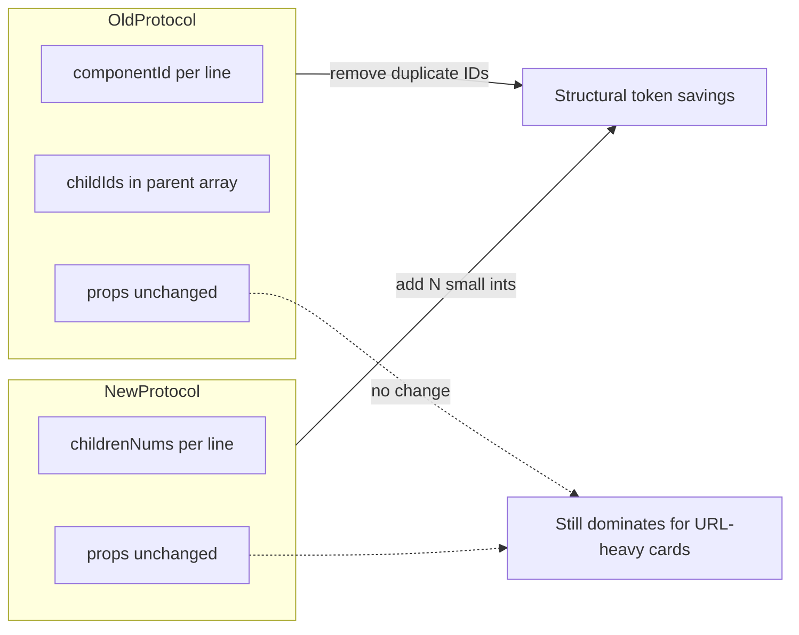
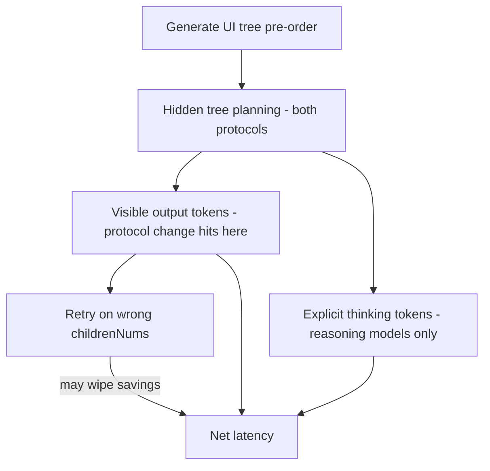

# GenUI 协议精简：Token 与时延客观评估

## 协议变更摘要

| 维度 | 原协议 | 新协议 |
|------|--------|--------|
| 形态 | `["<componentId>", "<Type>", {props}, [childIds]?]` | `["<Type>", <childrenNums>, {props}]` |
| 组件 ID | 每行必填，且子 ID 在父行 `children` 中重复引用 | 完全移除 |
| 子树关系 | 显式 ID 数组 | 仅记录直接子节点数量；子节点按**先序遍历**在后续行展开 |

先序遍历下，子节点本就会逐行输出，**ID + children 数组属于结构性冗余**——这正是本次改动能压缩的部分。

---

## 1. 能否降低输出 Token？——**能，但幅度取决于卡片结构，不是全体输出**

### 1.1 节省来源（可精确分解）

对一棵 **N 个节点、N-1 条边** 的 UI 树：

**原协议结构性 token 开销：**
- 每个节点行首 1 个 `componentId` → **N 次** ID 出现
- 每个布局节点的 `children` 数组 → 每个子节点 ID **再出现 1 次**（除 root 外每个 ID 恰好被父引用一次）
- 合计：每个非 root 节点的 ID 在输出中出现 **2 次**；另加 `[]`、`,`、`"` 等 JSON 标点

**新协议结构性开销：**
- 每行 1 个整数 `childrenNums`（个位数通常 **1 token**）

**净节省 ≈（旧协议全部 ID 与 children 数组 token）−（N 个整数 token）**

props 中的 `content`、`src`（URL）、价格等业务字段**完全不变**，因此**不会**同比例缩减。

### 1.2 用现有模板粗算（字符级 → token 级）

以 [coupon-guide.md](c:\a_ui\MCD-skills\references\guides\coupon-guide.md) 3 券列表示例（约 19 行 NDJSON）为例：

```
原：["coupon_list","List",{...},["coupon_1","coupon_2","coupon_3"]]
新：["List",3,{...}]
```

- 单行 children 数组约省 **40–60 字符**（3 个 snake_case ID + 括号逗号引号）
- 全卡约 19 个 componentId（如 `"coupon_1_image"` 平均 15–22 字符）+ 约 8 处 children 数组
- **结构性字符约省 500–800 字符** → 按常见 BPE 粗估 **~120–250 output tokens**
- 该卡含 3 条完整图片 URL + 文本 props，整段 genui 块约 **~1,800–2,500 tokens**
- **结构性节省约占 genui 块的 ~8–15%**

以 [mds-ordering-guide.md](c:\a_ui\MCD-skills\references\guides\mds-ordering-guide.md) 价格卡（24 行、布局 KV 行多、几乎无 URL）为例：

- 24 个 ID + 多层嵌套 children（如 root 5 子、price_rows 5 子）
- **结构性节省更高：约 ~200–400 tokens，占 genui 块 ~20–35%**（props 以短 label 为主，结构占比大）

### 1.3 结论（Token）

| 场景 | 预期 genui 块 token 降幅 | 说明 |
|------|--------------------------|------|
| 列表卡（多 Image URL + 长文本） | **~5–15%** | URL/文案占主导，结构冗余被稀释 |
| 表单/KV/价格明细卡 | **~15–35%** | 短 props、多布局节点，结构占比高 |
| 整段回复（含 Markdown 叙事） | **~3–20%** | 取决于 genui 占全文比例 |

**客观判断：能降 output token，且逻辑正确——冗余确实被删掉了；但这不是「减半」级别的优化，除非未来进一步把 `Type` 字符串也改成序号（example.txt 第 28 行提到的 UI 速览表序号，当前方案尚未采用）。**



---

## 2. 能否提升时延？——**有正向但有限，且仅作用于生成阶段**

### 2.1 时延构成

LLM 端到端时延大致为：

```
总时延 ≈ Prefill（输入处理，与输出格式无关）+ Σ(每个 output token 的解码时间)
```

- **Prefill / TTFT**：不受此协议变更影响
- **生成阶段**：output token 数减少 → 生成时间近似**线性缩短**（在同一模型、同一并发下）

### 2.2 量级估算

假设解码速度 **40–80 tok/s**（常见 streaming 区间）：

| 节省 output tokens | 约节省生成时间 |
|--------------------|----------------|
| 150 tokens（小列表卡） | **~2–4 s** |
| 300 tokens（中等价格卡） | **~4–8 s** |
| 整回复仅 50 tokens 结构节省 | **~0.6–1.2 s** |

注意：
- 若用户感知的是「首字出现」，**几乎无改善**（TTFT 不变）
- 若感知的是「整张 genui 卡流式渲染完成」，**与 token 节省同比例改善**
- Markdown 叙事、工具调用、API 等待仍占大量 wall-clock，**全链路时延改善通常小于 genui 块本身的 token 降幅**

### 2.3 客户端解析

新协议需栈式先序重建（读一行、按 `childrenNums` 弹栈挂子树）。复杂度 O(N)，相对 LLM 生成耗时可忽略，**不构成瓶颈**。

**客观判断（初版）**：output token 减少理论上能缩短生成时间——但**见 §2.4 修正**：若计入模型内部推理成本与计数错误，净时延收益可能被部分或全部抵消。

### 2.4 修正：模型「思考树结构」是否让时延收益失效？

这是一个**必须单独讨论**的问题。结论：**output token 的节省是真实且可计量的；但净时延收益取决于模型类型，且可能被计数负担和重试反噬——不能简单等同于「少写多少 token 就快多少秒」。**

#### 2.4.1 先分清三类「成本」

| 成本类型 | 是否计费 / 是否占 wall-clock | 协议变更是否影响 |
|----------|------------------------------|------------------|
| **Hidden 计算**（attention 里隐式规划树） | 不占 output token；耗时主要在 prefill+逐 token 解码 | **两种协议都要做**，几乎不变 |
| **显式 thinking / reasoning token**（o1、Extended Thinking、R1 等） | **计费且占生成时间** | 树结构规划若写进 thinking，**不受 output 精简影响** |
| **可见 output token**（genui NDJSON 正文） | 计费且占生成时间 | **这是协议变更直接压缩的部分** |

因此：
- **普通流式模型（无 thinking 块）**：树结构在 hidden 层处理，**不额外占 output token**；协议精简带来的时延收益**相对最直接**——少写的 ID/children 就是少解码的 token。
- **带 thinking 的推理模型**：用户担心的场景成立——模型可能在 thinking 里做「这行 Column 有几个子节点」「先序下一段该闭合哪层」等推理，**这部分 token 不会随协议变短而减少**，甚至可能因计数任务**变长**。

#### 2.4.2 「模型对数字不敏感」对新协议的具体影响

新协议把「子节点关系」从 **ID 字符串列表** 变成 **`childrenNums` 整数**。需要注意：

**先序 + 父行先出**：无论新旧协议，布局节点的**父行都先于子行**输出。旧协议写 `["row_a","Row",{...},["img_a","txt_a"]]` 时，模型同样要先决定「这个 Row 有几个孩子、分别是谁」——**树形规划本身无法省掉**。

差异在于父行里写什么：
- **旧协议**：把决策结果编码成 **snake_case ID 字符串**（模型擅长逐 token 生成语义化名字）
- **新协议**：把决策结果编码成 **一个整数 N**（模型在精确计数、跨层栈式跟踪上更弱）

| 维度 | 旧协议（ID + children 数组） | 新协议（childrenNums） |
|------|------------------------------|------------------------|
| 需要先想清楚子树 | 是 | 是（一样） |
| 父行输出难度 | 较长，但 ID 可「边想边起名」 | 较短，但 **N 错一位全盘错位** |
| 模型计数准确性 | 不直接考计数（写 ID 列表即可） | **显式考计数**，已知弱项 |
| 错误后果 | ID 不一致，局部可 grep 修 | 先序栈错位，**整卡后续全废** |

所以：**省掉的是 output 里的冗余字符串，不是省掉「在脑子里建树」这一步。** 甚至 `childrenNums` 可能让模型在生成父行时**多一轮内部核对**（「我数一下是不是 3 个」），这在 thinking 模型里会体现为**更多 reasoning token**。

#### 2.4.3 净时延：一张修正后的账本

```
净时延变化 ≈ 节省的 output 解码时间
           − 可能增加的 thinking / 重试时间
           − 计数错误导致的整卡重写
```

**情景 A — 普通模型 + 固定 guide 模板填空（MCD 技能主路径）**
- 树拓扑来自 guide 静态模板，模型主要是**填 props**，不是即兴设计布局
- 子节点数量对模型几乎是**查表/背板**，不是现场数数 → **计数负担低**
- 此时：**output token 节省 ≈ 净时延收益**，粗估仍可达 **1–4 s / 卡**（视卡片大小）
- **这是协议改动最划算的场景**

**情景 B — 普通模型 + 自由生成复杂 UI（读 GenUI.md 即兴拼树）**
- 拓扑不固定，模型需实时规划 + 输出正确 N
- output 省 150–300 tokens，但计数错误率上升 → 偶发整段重写
- **净收益缩小**：平均可能只剩 **0.5–2 s**，极端情况**重试一次就亏**

**情景 C — 推理 / thinking 模型**
- thinking 中仍要规划树；计数可能额外占 **数十至数百 reasoning tokens**
- 若 reasoning 占 500+ tokens，则 output 省 200 tokens **不足以抵消**
- **净时延：可能持平甚至略慢**——协议优化对此类模型**不是首选杠杆**

#### 2.4.4 对「是否真的有用」的直接回答

| 问题 | 回答 |
|------|------|
| 模型还要思考树吗？ | **要。** 协议改的是 output 编码，不是生成任务本身。 |
| thinking 会占 token 吗？ | **Thinking 模型会**；普通模型 mostly 不计入可见 token，但占 hidden 计算（两种协议差不多）。 |
| 数字不敏感会让收益泡汤吗？ | **部分会。** 主要风险是 `childrenNums` 写错 → 解析失败 → 重试；在模板化场景风险低，自由生成 + thinking 模型风险高。 |
| 时延降低还有没有用？ | **有用，但应下调预期**：不是「结构性 token 省多少就快多少」，而是 **省 output − 增 thinking/重试** 的净值；MCD 模板化路径仍偏正，thinking 模型偏不确定。 |



---

## 3. 非 token 维度的收益与代价

### 3.1 潜在收益（难量化但真实）

- **降低 ID 发明负担**：不必维护全局唯一 snake_case ID，减少「children 里写了 `coupon_1` 但下一行写成 `coupon_01`」类错误——**但计数负担换 ID 负担，并非单向减负**
- **每行更短**：流式场景下单行更早闭合，利于按行 NDJSON 解析（边际收益）
- **与先序语义一致**：协议与生成顺序对齐，文档规则可简化（[GenUI.md](c:\a_ui\MCD-skills\GenUI.md) 中「父先子后 / ID 交叉引用」约束可删除）

### 3.2 风险（可能抵消部分 token/时延收益）

- **`childrenNums` 错误是 catastrophic**：少计/多计 1 会导致后续整棵子树错位；旧协议 ID 不匹配也出错，但调试时可 grep ID
- **计数弱项 + 重试**：一次整卡重写（2000+ tokens）可吃掉多次结构节省；**净时延可能为负**
- **Thinking 模型不受益**：树规划 reasoning token 不随 output 精简而减少
- **无可读 ID**：guide 模板维护、日志排查变难（需改 [SKILL.md](c:\a_ui\MCD-skills\SKILL.md) 及全部 guide 示例）
- **需同步改消费端**：当前仓库仅有技能文档，**未见运行时 parser**；若宿主侧仍按旧协议解析，必须一并升级

---

## 4. 综合结论（含 thinking / 计数修正）

| 指标 | 评价 |
|------|------|
| 降低 output token | **是，客观成立**；典型 **5–35%（仅 genui 块）**；这是**可验证的硬收益** |
| 降低 thinking token | **否 / 不确定**；树规划仍在；thinking 模型甚至可能因计数**略增** reasoning |
| 提升时延（净值） | **有条件成立**：模板化 + 普通流式模型 → **小幅正向（~1–4 s/卡）**；自由生成或 thinking 模型 → **收益大幅缩水，可能持平或更慢** |
| 是否值得做 | **若目标是降 output 成本**：值得；**若目标是降端到端时延**：仅在 MCD 类「guide 模板填空」路径上期望合理；需 A/B 测 `childrenNums` 错误率 |
| 下一步放大收益 | Type 序号化可继续压 output；**更稳的时延杠杆**可能是缩短 guide 模板行数、减少 GenUI.md 全量读取、或 props 字段裁剪 |

**一句话（修正版）：协议精简确实减少可见 output 中的冗余 token，但**不能**假设模型因此少「思考」树——树形规划成本只是从 output 字符串搬到了 hidden（或 thinking）里；`childrenNums` 还引入了计数弱项风险。** 对 MCD 技能这种拓扑固定的模板填空，净时延仍可能小幅改善；对 thinking 模型或复杂即兴 UI，不宜把时延优化押在这项改动上。**

---

## 5. 若后续落地需改动的文件（供参考，非本次评估范围）

- [GenUI.md](c:\a_ui\MCD-skills\GenUI.md) — 协议定义、示例、约束
- [SKILL.md](c:\a_ui\MCD-skills\SKILL.md) — 最小骨架与 Phase 3 规则
- [references/guides/*.md](c:\a_ui\MCD-skills\references\guides) — 全部 NDJSON 输出示例（约 8 个 guide）
- 宿主侧 genui 解析/渲染器（仓库外，需栈式先序重建）
