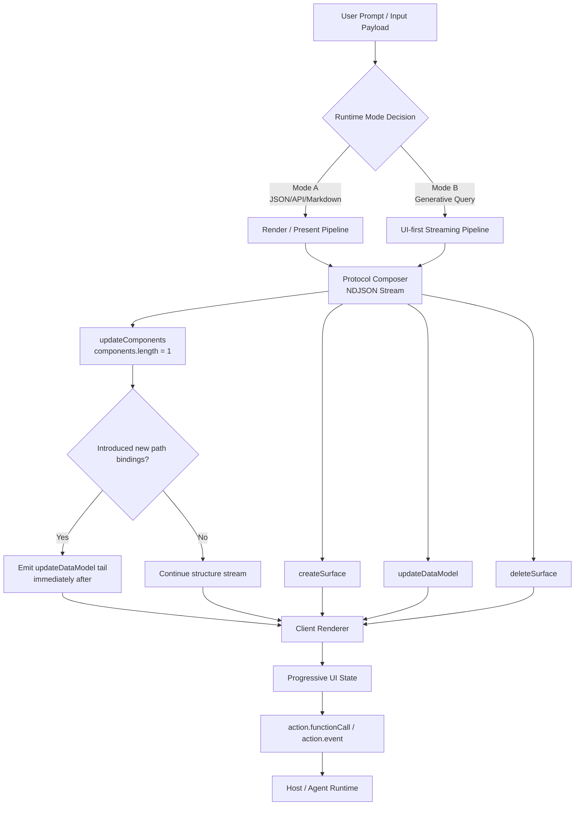
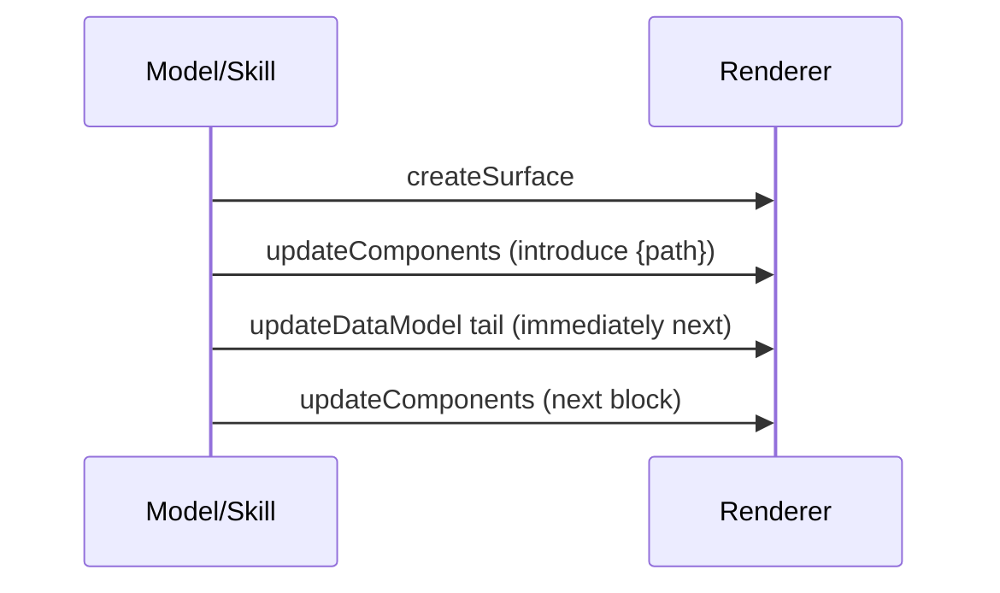
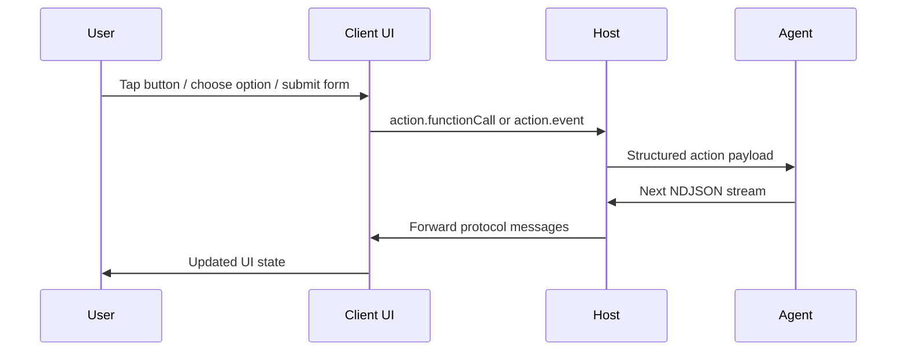

# A2UI Skill（`a2ui` 目录 / v0.9 协议）

本目录是 **A2UI Protocol v0.9** 的 Agent Skill：**服务端 → 客户端** 的 **NDJSON**（每行一条完整 JSON 消息），组件体系为 **`Extended.*`** + **`styles`**（Common Styles），视觉意图对齐鸿蒙规范（见 `reference/design/harmony-style.md`）。

一句话定位：把用户输入（自然语言 / Markdown / 结构化 JSON / API 结果）稳定收敛为 **可解析、可流式、可交互、视觉一致** 的 **A2UI v0.9 NDJSON 协议流**。

非目标（边界清晰）：

- 本仓 **不实现渲染器/宿主**；这里只定义 **Agent 输出**的协议形状、流式纪律、交互载荷与样式规范如何被采纳。
- 本仓 **不是“任意 UI 生成”**：输出必须在宿主上可逐行解析与渲染；样式必须落在 Harmony 规范可执行子集。

## 触发方式（示例话术）

- 「用 A2UI 生成一个登录表单」
- 「输出 A2UI v0.9 NDJSON，Extended 组件」
- 关键词：`A2UI`、`createSurface`、`updateComponents`、`updateDataModel`、`deleteSurface`、`Extended.*`

实际行为以根目录 **[`SKILL.md`](SKILL.md)**（frontmatter + 正文）为准。

## 架构总览（讲解版：一条主线 + 两层护栏 + 三个闭环）

`a2ui` 的整体设计用一句话概括是：

- **主线**：输入 →（Mode A / Mode B）→ 协议流（NDJSON）→ 渲染 → 交互回传 → 下一轮协议流
- **护栏 P（Protocol）**：保证 **可解析、可流式、可演进、可回传**
- **护栏 D（Design / Harmony）**：保证 **视觉一致性与可执行子集**（不靠“自由发挥”）



### 分层职责（从“可生成”到“可落地”）

- **协议输出层**：输出严格 NDJSON；每条 `updateComponents` 仅一个组件对象；保证宿主可逐行解析与渲染（权威：[`SKILL.md`](SKILL.md) §0）。
- **数据模型层（Mode A structured JSON）**：结构化 JSON 输入时，payload 进入 surface data model，组件用 `{"path":"..."}` 绑定，`updateDataModel` 负责增量供数（权威：[`SKILL.md`](SKILL.md) §0）。
- **流式时序层**：引入新 `path` 绑定的结构消息后，按规则就近发送 `updateDataModel` tail，避免“流尾一次性灌值”导致首屏空渲染（权威：[`SKILL.md`](SKILL.md) §0；示例：[`reference/protocol/extended-output-format.md`](reference/protocol/extended-output-format.md)）。
- **交互层**：统一用 `action.functionCall`（如 `openUrl`）/ `action.event`（如 `submit_form`），`context` 只允许可解析的绑定与取值形状（权威：[`SKILL.md`](SKILL.md) §0a，[`reference/protocol/extended-interactions.md`](reference/protocol/extended-interactions.md)）。
- **视觉规范层（Harmony）**：以 token + 组件矩阵 + 卡片规范的优先级做样式治理，限制在可执行子集（入口：[`DESIGN.md`](DESIGN.md)，[`reference/design/style-runtime-index.md`](reference/design/style-runtime-index.md)）。

## 两种运行模式（Mode A / Mode B）

两种模式共享同一套输出契约（NDJSON、单组件粒度、交互形状、样式白名单），差异在于“内容来自哪里、先给什么”：

- **Mode A（Render / Present）**：输入包含外部内容（JSON / API 结果 / Markdown 文本等），目标是把内容 **保真呈现为 UI**。
- **Mode B（UI-first Streaming）**：输入偏生成式（指南、介绍、方案等），目标是 **先给可用骨架**，再逐步补齐内容。

模式判定与具体约束以 [`SKILL.md`](SKILL.md) 为准（建议从 §1 Two runtime modes 开始读）。

## 护栏 P（Protocol）：协议与流式纪律（工程可落地的经验规则）

这层护栏解决的是“输出是否可用、是否可流式、是否可维护与可回传”的工程问题。权威规则只在 [`SKILL.md`](SKILL.md) §0 / §0a；下列是面向讲解的组织方式（不取代权威）。

### A1. 可解析（Parser Safety）

- **NDJSON 一行一消息**：`createSurface` / `updateComponents` / `updateDataModel` / `deleteSurface` 只能以完整 JSON 对象逐行输出（权威：[`SKILL.md`](SKILL.md) §0）。
- **单组件粒度**：每条 `updateComponents.components` 长度必须为 1（权威：[`SKILL.md`](SKILL.md) §0；协议形状：[`reference/protocol/schema.md`](reference/protocol/schema.md)）。
- **字符串可解析**：任何 JSON 字符串内的 `"` 必须转义，避免宿主 `JSON.parse` 失败（权威：[`SKILL.md`](SKILL.md) §0）。

### A2. 可流式可见（Progressive Visibility）

结构化 JSON 驱动时，核心工程目标是“结构一出现就能尽快看到内容”，而不是等到流尾才能渲染：

```mermaid
flowchart LR
    A[updateComponents introduces {path}] --> B[updateDataModel tail (same surfaceId)]
    B --> C[next updateComponents]
```

- **引入 binding 就近 tail**：当 `updateComponents` 首次引入 `{"path":"..."}` 绑定，必须按 [`SKILL.md`](SKILL.md) §0 的规则完成 `updateDataModel` tail（示例：[`reference/protocol/extended-output-format.md`](reference/protocol/extended-output-format.md)）。
- **payload 不写死为 literals**：Mode A structured JSON 下，payload-backed 文本/图片/动态字段应绑定到 model（`{"path":"..."}`）并由 `updateDataModel` 供数，避免“结构和数据双写”破坏增量演进（权威：[`SKILL.md`](SKILL.md) §0；示例：[`examples/inputs/json-input/product-compact-card.md`](examples/inputs/json-input/product-compact-card.md)）。

### A3. 可演进（Maintainability / Minimal Patches）

- **结构与数据分离**：结构稳定后，优先用 `updateDataModel` 做增量更新，减少重发组件树（协议：[`reference/protocol/schema.md`](reference/protocol/schema.md)；规则：[`SKILL.md`](SKILL.md) §0）。
- **字段拼写与 schema 对齐**：只使用 schema 声明的组件与 `styles` 键（入口：[`reference/protocol/extended-ui-schema.md`](reference/protocol/extended-ui-schema.md)）。

### A4. 可回传（Interaction Loop）

- **本地行为**：`action.functionCall`（如 `openUrl`）以宿主能力为准（权威：[`reference/protocol/extended-interactions.md`](reference/protocol/extended-interactions.md)，[`SKILL.md`](SKILL.md) §0a）。
- **服务端事件**：需要把表单/选择一次性上送时，使用 `action.event.name = "submit_form"`，`context` 用 `{ "path": "/..." }` / `getSelectedValues` / 稳定字面量（权威：[`reference/protocol/extended-interactions.md`](reference/protocol/extended-interactions.md)，[`reference/design/interaction-design.md`](reference/design/interaction-design.md)）。

## 护栏 D（Design / Harmony）：设计系统规则如何在运行时生效

这层护栏解决的是“模型输出在视觉上是否一致、是否符合鸿蒙风格、是否可跨宿主稳定落地”的问题。核心设计是：把“审美/规范”变成 **可执行的规则子集与模板化出口**。

### B1. 双模式路由（Card Mode / UI Mode）

- **Card Mode（JSON 输入）**：强调卡片结构、列表/宫格比例、圆角/间距等强约束。
- **UI Mode（Markdown / Query）**：以 token + 组件矩阵为主，卡片规范仅借鉴，不强行套壳。

入口与优先级以 [`DESIGN.md`](DESIGN.md) 与 [`reference/design/style-runtime-index.md`](reference/design/style-runtime-index.md) 为准。

### B2. 规则优先级与真理源

运行时样式采用明确的优先级与白名单，避免“自由发挥”：

- **Token（语义）**：[`reference/design/harmony-design-token.md`](reference/design/harmony-design-token.md)
- **组件矩阵（可变性/组合/降级）**：[`reference/design/harmony-ui-components-a2ui.md`](reference/design/harmony-ui-components-a2ui.md)
- **卡片规范（Card Mode 强约束）**：[`reference/design/harmony-card-spec.md`](reference/design/harmony-card-spec.md)

### B3. 模板化出口（可复制片段与稳定默认）

- **可复制片段**：[`reference/design/quick-snippets.md`](reference/design/quick-snippets.md)
- **示例索引**：[`examples/README.md`](examples/README.md)

## 三个闭环（把主线与护栏“扣回运行时”）

### 闭环 1：流式渲染闭环（结构先到 → 数据紧随 → 立刻可见）



关键点：**绑定出现的位置**决定了 **数据应出现的时机**。规则与例子请以 [`SKILL.md`](SKILL.md) §0 与 [`reference/protocol/extended-output-format.md`](reference/protocol/extended-output-format.md) 为准。

### 闭环 2：交互回传闭环（UI 触发 action → 上送 → 下一轮 UI 更新）



入口：[`reference/protocol/extended-interactions.md`](reference/protocol/extended-interactions.md)（权威形状）与 [`reference/design/interaction-design.md`](reference/design/interaction-design.md)（交互组件选择与六合一示例）。

### 闭环 3：视觉一致性闭环（token → 组件矩阵 → 模板/snippets → examples）

入口：[`DESIGN.md`](DESIGN.md)（路由与边界）→ [`reference/design/style-runtime-index.md`](reference/design/style-runtime-index.md)（优先级与白名单）→ `harmony-*` 规范（真理源）→ [`reference/design/quick-snippets.md`](reference/design/quick-snippets.md) / `examples/*`（可复用形状）。

## 为什么这套架构适合生产场景（面向决策的客观收益）

- **可观测**：一行一消息，问题定位可以精确到单条 NDJSON。
- **可演进**：组件树与数据分离，后续改样式或改数据源的成本更低。
- **可回传**：交互事件结构化，宿主和 Agent 的对接更稳定。
- **可约束**：协议、交互、样式都有硬边界，降低模型“自由发挥”导致的不可控输出。

## 目录结构（本仓库实际布局）

```
a2ui/
├── SKILL.md                          # 核心指令（必读）
├── DESIGN.md                         # 鸿蒙风格设计语言（给 Agent 读）
├── README.md                         # 本文件
├── reference/
│   ├── protocol/                     # 协议 & Schema
│   │   ├── extended-interactions.md
│   │   ├── extended-ui-schema.md
│   │   ├── extended-output-format.md
│   │   └── schema.md
│   ├── design/                       # 鸿蒙设计意图 + 组件使用建议
│   │   ├── harmony-design-token.md
│   │   ├── harmony-ui-components-a2ui.md
│   │   ├── harmony-card-spec.md
│   │   ├── harmony-style.md
│   │   ├── quick-snippets.md
│   │   ├── style-runtime-index.md
│   └── README.md                     # reference 索引（推荐入口）
├── examples/
│   ├── README.md                     # 示例索引（推荐入口）
│   ├── flows/                        # Form / Flow
│   └── inputs/                       # 输入映射（markdown/json）
```

## 如何阅读（最短路径）

### 路径 1：只想会用（5–10 分钟）

1. [`SKILL.md`](SKILL.md) — 先看 **§0 Output contract**（输出纪律与流式规则）
2. [`reference/design/quick-snippets.md`](reference/design/quick-snippets.md) — 直接复用骨架与常见组件片段
3. [`examples/README.md`](examples/README.md) — 选一个最接近场景的示例

### 路径 2：要对接宿主/排协议问题（偏工程）

1. [`SKILL.md`](SKILL.md) §0 / §0a
2. [`reference/protocol/schema.md`](reference/protocol/schema.md) — 协议形状与 `updateDataModel`
3. [`reference/protocol/extended-ui-schema.md`](reference/protocol/extended-ui-schema.md) — 组件与 `styles` 白名单
4. [`reference/protocol/extended-output-format.md`](reference/protocol/extended-output-format.md) — NDJSON 示例与流式示例

### 路径 3：要做 Harmony 一致性/出规范（偏设计系统）

1. [`DESIGN.md`](DESIGN.md)
2. [`reference/design/style-runtime-index.md`](reference/design/style-runtime-index.md)
3. `harmony-*` 三件套：[`harmony-design-token.md`](reference/design/harmony-design-token.md)、[`harmony-ui-components-a2ui.md`](reference/design/harmony-ui-components-a2ui.md)、[`harmony-card-spec.md`](reference/design/harmony-card-spec.md)
4. [`reference/design/harmony-style.md`](reference/design/harmony-style.md)（详规入口）

## Examples（两条能力线）

- **DSL output examples (NDJSON)**：`examples/flows/*`等目录中，Markdown 里以 \`\`\`jsonl 开头的围栏代码块与 **`.ndjson` 文件**（若有）均为 **A2UI v0.9 NDJSON（Extended DSL）** 示例。
- **Markdown input → UI examples**：`examples/inputs/markdown-input/*.md` 展示「输入 Markdown 文本」如何生成 **高端精致的网页式信息 UI**（并给出对应 NDJSON 参考输出）。
- 示例逻辑分类导航见：[`examples/README.md`](examples/README.md)。

## 上行事件（客户端 → 服务端）

客户端上报 **`action`**（内层可为 **`functionCall`** 或 **`event`**，如 **`submit_form`**）；**`version`** 为传输层可选项，见 [`reference/protocol/extended-interactions.md`](reference/protocol/extended-interactions.md)。

## 主题与 catalog

`createSurface` 使用 **`catalogId`**（示例中常见 `https://xxx/specification/ohos/extended_catalog.json`）及 **`theme`**；`theme` 仅传**当前渲染器已支持**的键（通常至少 `primaryColor`）。不要假设未在 schema/宿主文档中出现的 theme 键一定生效。

## 常见误区 / 排障入口（不展开细节，只给定位路径）

- **首屏空白/要等输出结束才显示**：优先检查 structured JSON 下是否遵守 `path` 引入点与 `updateDataModel tail` 的就近配对（权威：[`SKILL.md`](SKILL.md) §0；示例：[`reference/protocol/extended-output-format.md`](reference/protocol/extended-output-format.md)）。
- **white-on-white（白底白字/对比度不足）**：优先用语义 token 口径排查背景与字体层级（入口：[`reference/design/harmony-design-token.md`](reference/design/harmony-design-token.md)，[`reference/design/harmony-style.md`](reference/design/harmony-style.md)）。
- **交互做成了“提示用户输入”但 UI 上不可点选/不可回传**：按交互组件选择与 `submit_form` 规则重构（入口：[`reference/design/interaction-design.md`](reference/design/interaction-design.md)，[`reference/protocol/extended-interactions.md`](reference/protocol/extended-interactions.md)）。

## 常见问题

**Q: 空列表怎么表达？**
见 [`examples/flows/list.md`](examples/flows/list.md) 的 **Empty State** 一节。

**Q: 模态 / 确认流里表单数据怎么带到 action？**
用路径绑定与宿主约定的 `context` 字段组装；见 [`examples/flows/modal.md`](examples/flows/modal.md)。

**Q: 官方 JSON Schema / catalog 资产在哪里？**
以你们工程内与 **A2UI v0.9** 同步的 `server_to_client.json`、`basic_catalog.json` 等为准；本 skill 的叙述与示例需与宿主实现对齐。

## 六类交互 + `submit_form` 合一示例

覆盖 **TextInput、Toggle、Radio、Checkbox、CheckboxGroup、Select** 与 **带 `action.event`：`submit_form` 的主 `Extended.Button`** 的整卡 NDJSON 见 [`reference/design/interaction-design.md`](reference/design/interaction-design.md) 中 **「总示例：六类交互 + `submit_form` 主按钮」**。

## 反馈

问题或改进建议可在项目仓库提 Issue。
