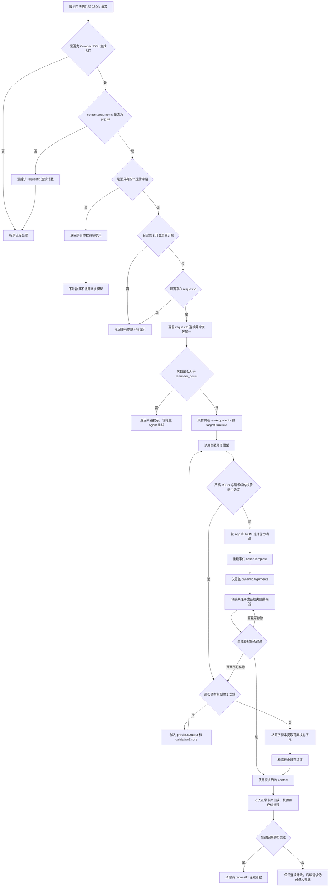

# arguments 参数修复兜底流程（临时说明）

> 本文件用于当前联调和评审，描述 `generateWidgetCardCompactDsl` 收到字符串化
> `content.arguments` 时的临时兜底实现。正式方案仍以仓库根目录的
> `docs/云侧方案设计.md` 为准。

## 1. 要解决的问题

外层 WebSocket 请求本身仍然是合法 JSON，但主 Agent 偶尔会把生成参数整体放进
`content.arguments`，并把它编码成字符串：

```json
{
  "content": {
    "romVersion": "VYG-AL00 7.0.0.105",
    "arguments": "{\"userQuery\":\"实时天气卡片\",\"candidateDataBindings\":[..."
  }
}
```

这个字符串可能同时存在以下问题：

- 缺少右花括号或右方括号；
- 引号、转义或逗号错误；
- 本应为数组的字段被写成单个对象或字符串；
- 对象被再次编码成 JSON 字符串；
- 括号缺失导致后续字段进入错误层级；
- 模型恢复出的 JSON 虽然语法合法，但事件参数不符合当前版本能力清单。

正常请求应把业务参数直接放在 `content` 中：

```json
{
  "content": {
    "romVersion": "VYG-AL00 7.0.0.105",
    "userQuery": "实时天气卡片",
    "title": "实时天气",
    "description": "显示实时天气",
    "size": "2x2",
    "candidateDataBindings": [],
    "candidateEventCandidates": [],
    "candidateAssetIds": []
  }
}
```

## 2. 开关和次数配置

```yaml
enable_compact_dsl_argument_repair_fallback: false
compact_dsl_argument_repair_reminder_count: 1
compact_dsl_argument_repair_max_attempts: 2
```

### `enable_compact_dsl_argument_repair_fallback`

- `false`：关闭自动兜底，发现字符串化 `arguments` 后只返回原有纠错提示。
- `true`：开启同一 `requestId` 的连续异常计数和自动修复。

蓝区默认关闭，只有显式开启后才调用参数修复模型。

### `compact_dsl_argument_repair_reminder_count`

进入自动兜底前，允许向主 Agent 返回多少次纠错提醒。

- `0`：第一次异常就进入自动修复；
- `1`：第一次提醒，第二次连续异常进入自动修复；
- `2`：前两次提醒，第三次连续异常进入自动修复。

计数按 `requestId` 隔离。中间出现一次不带字符串化 `content.arguments` 的请求，会清除该
`requestId` 的连续计数。

### `compact_dsl_argument_repair_max_attempts`

已经进入自动兜底后，参数修复模型最多调用多少次。当前实现把配置限制在 `1～3` 次，默认 `2` 次。

- 第一次：携带原始字符串、目标结构和需要保留的顶层字段；
- 后续次数：额外携带上一次模型输出和严格校验错误，进行定向修正；
- 所有模型调用都失败：不再返回参数修复错误，进入最小静态请求降级。

该配置只控制“参数修复模型”的内容级重试，不是卡片 DSL 校验重试，也不是底层网络传输重试。

## 3. 不进入自动修复的特殊情况

当 `content` 只有以下四个工具层透传字段时：

```text
uid、odid、romVersion、bundleName
```

服务无法取得原始字符串 `arguments`，因此保持原逻辑：只提醒主 Agent 使用合法 JSON 对象重新调用，
不累计次数，也不调用参数修复模型。

## 4. 模型输入

参数修复使用 A2UI client 的 `raw-json` profile。这个 profile 只转发当前修复提示词，不绑定卡片生成
Prompt，也不执行 Compact DSL 转换。

第一次修复的模型输入结构如下：

```json
{
  "rawArguments": "原始、不规则的 arguments 字符串",
  "targetStructure": {
    "userQuery": "non-empty string, required",
    "title": "non-empty string, required when sourceArtifactUrl is absent",
    "description": "non-empty string, required when sourceArtifactUrl is absent",
    "candidateDataBindings": [
      {
        "capabilityId": "string",
        "arguments": "object",
        "writeResultTo": "string",
        "candidateOutputFields": ["string"]
      }
    ],
    "candidateEventCandidates": [
      {
        "capabilityId": "string",
        "action": {
          "call": "string",
          "args": "object"
        }
      }
    ],
    "candidateAssetIds": ["string"]
  },
  "preservedTopLevelFields": {
    "romVersion": "VYG-AL00 7.0.0.105"
  }
}
```

关键约束：

- `rawArguments` 始终原样发送，不先使用 `json_repair` 或其它工具猜测修复；
- `uid`、`odid` 不发送给修复模型，修复完成后由服务从原请求恢复；
- `targetStructure` 只提供字段层级和类型，不提供真实业务值；
- Prompt 中的 few-shot 使用中性示例，并明确禁止复制示例值；
- 模型只需恢复 JSON 语法和结构，不负责判断具体接口或生成协议。

第二次及后续修复还会加入：

```json
{
  "previousOutput": "上一次模型的完整原始输出",
  "validationErrors": [
    "model output is invalid JSON at line 1 column 37"
  ]
}
```

重试时仍以 `rawArguments` 为事实来源，`previousOutput` 仅用于定位和修正上一次错误。

## 5. 每次模型输出后的严格校验

模型返回非空内容不等于修复成功。每次输出依次经过：

1. 只允许纯 JSON object，或完整的 Markdown JSON 代码块；
2. 使用标准 `json.loads` 解析，不使用 `json_repair`；
3. 根节点必须是非空 object；
4. 不允许重复的整体包装字段；
5. 不允许目标结构之外的未知顶层字段；
6. 使用 `GenerateWidgetCardRequest` 校验必填字段、数组、对象、枚举和编辑模式语义；
7. 按请求中的 App 版本和 ROM 版本选择当前能力清单；
8. 执行生成预检，检查数据参数、输出路径、事件参数、素材以及候选间关系。

任一步失败都会形成 `validationErrors`。如果还有修复次数，则带着错误再次调用模型。

## 6. 能力清单规范化

模型恢复出的结构通过基础请求校验后，还不能直接进入生成流程。服务会按照当前请求命中的能力清单进行
确定性规范化。

### 数据候选

- 未注册或当前版本不存在的数据能力会被移除；
- 已注册但输入参数、输出字段或写入路径无法通过生成预检的候选会被移除；
- 其它合法数据候选原样保留。

### 素材候选

- 未注册或当前版本不存在的素材 ID 会被移除；
- 其它合法素材 ID 原样保留。

### 事件候选

事件的 `action` 不信任模型给出的固定结构，而是从当前能力清单的 `actionTemplate` 重新构造：

```text
当前能力清单 actionTemplate
        +
模型结果中 dynamicArguments 明确声明的动态值
        =
最终事件 action
```

例如，模型返回：

```json
{
  "capabilityId": "event.call.phone",
  "action": {
    "call": "hallucinatedCall",
    "args": {
      "intentName": "HallucinatedIntent",
      "params": {
        "phoneNumber": "122",
        "relationship": ""
      }
    }
  }
}
```

当前能力清单只允许动态填写 `/params/phoneNumber`，规范化后得到：

```json
{
  "capabilityId": "event.call.phone",
  "action": {
    "call": "clickToApi",
    "args": {
      "intentName": "CallPhone",
      "params": {
        "phoneNumber": "122"
      }
    }
  }
}
```

因此，错误的 `call`、`intentName` 和未声明的 `relationship` 都不会继续进入生成预检。

## 7. 最小静态请求降级

如果达到 `compact_dsl_argument_repair_max_attempts` 后仍没有合法模型输出，服务不再依赖模型修复结果。

它会直接扫描原始字符串中能够被标准 JSON 解码器完整识别的核心字段：

```text
userQuery、title、description、size、sourceArtifactUrl、bundleName、romVersion
```

这个扫描只提取完整值，不尝试补括号、截断字符串或重排 JSON，因此不会产生 `json_repair` 式的信息覆盖。

新建场景的最小请求示意：

```json
{
  "userQuery": "从原字符串提取的用户需求",
  "title": "从原字符串提取的标题；没有时使用通用标题",
  "description": "从原字符串提取的说明；没有时使用 userQuery",
  "size": "2x2",
  "candidateDataBindings": [],
  "candidateEventCandidates": [],
  "candidateAssetIds": [],
  "options": {
    "allowDegradation": true
  }
}
```

这条路径不保留无法验证的动态能力，目标是确保参数恢复阶段能产出合法请求并继续执行生成流程。

编辑场景如果能完整提取 `sourceArtifactUrl`，会保留该 URL 和编辑需求，不主动构造新的动态候选。

## 8. 完整流程图



## 9. 当前成功边界

本兜底保证的是：

- 不会把 `json_repair` 的猜测结果作为事实输入；
- 模型输出非法 JSON 或非法请求结构时会执行定向内容重试；
- 模型始终失败时，参数恢复阶段仍会产生合法的最小请求；
- 模型恢复出的非法事件固定字段不会绕过当前能力清单；
- 参数恢复后的请求仍经过正常生成预检，不绕过既有校验。

它不能保证模型生成、网络、OBS 上传等后续外部依赖永远成功。这里的“兜底成功”是指参数恢复阶段一定
给出可继续处理的合法请求，而不是绕过后续生成与产物校验直接伪造成功结果。

## 10. 相关实现位置

- 路由触发与连续计数：`cloud/api/routes.py`
- 参数恢复模块：`cloud/services/compact_dsl_argument_repair.py`
- 参数恢复 Prompt：
  `cloud/data/protocol_profiles/design-compact-dsl/ARGUMENT_REPAIR_SYSTEM_PROMPT.md`
- 配置模型：`cloud/config/config.py`
- 蓝区默认配置：`cloud/config/default_config.yaml`
- 主要回归测试：`tests/test_tool_dispatch_routes.py`
